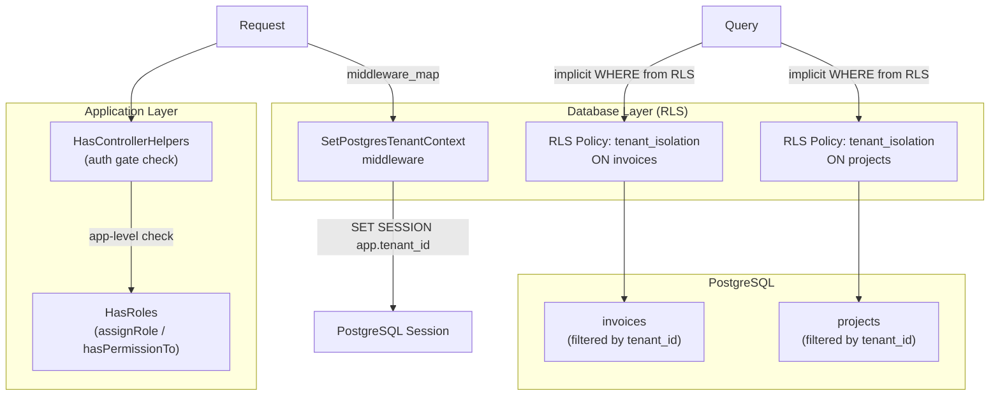

# PostgreSQL Row-Level Security (RLS)

The package provides an **optional** PostgreSQL RLS integration that adds database-level tenant isolation on top of the existing application-level permission system.

RLS is **defense-in-depth** — it guards against direct database access bypassing the app. It does **not** replace the built-in role/permission system (HasRoles, Gates, `sp_*` tables).

> **Zero breakage guarantee:** RLS is entirely opt-in. No middleware is auto-applied, no command auto-runs, and the `OR NULL` fallback in every policy prevents data from being hidden until the middleware actively sets a tenant value.

---

## Architecture



### Two Layers of Protection

| Layer | Mechanism | Enforces |
|-------|-----------|----------|
| **Application** (existing) | `RecordService::applyTenantFilter()`, HasRoles Gates | Business logic: who can do what |
| **Database** (new) | PostgreSQL RLS policies | Tenant isolation: what rows any query can see |

Both layers work independently. Enabling RLS does not change app-level behavior.

---

## Setup

### 1. Enable Tenant ID

In `config/record.php`:

```php
'enable_tenant_id' => true,
'tenant_column' => 'tenant_id',
'tenant_column_type' => 'string', // or integer, bigint, uuid
```

Set `hasTenantId: true` on each table in `config/record.php`:

```php
'tables' => [
    'invoices' => new RecordTableType(
        table: 'invoices',
        hasTenantId: true,
        // ...
    ),
],
```

### 2. Add Middleware to `middleware_map`

Wire the `SetPostgresTenantContext` middleware in `config/record.php`. Apply it globally or per table:

```php
'middleware_map' => [
    'default' => [
        '*' => [],
        'read' => ['pgsql.tenant'],          // set tenant context for all reads
        'write' => ['pgsql.tenant'],          // set tenant context for all writes
        'function' => ['pgsql.tenant'],
    ],
    'tables' => [
        // Or apply only to specific tables:
        // 'invoices' => [
        //     '*' => ['pgsql.tenant'],
        // ],
    ],
],
```

The middleware:
- Checks `DB::getDriverName() !== 'pgsql'` and exits immediately for non-PGSQL drivers
- Resolves the tenant ID from the request using `RecordUtils::resolveTenantIdFromRequest()` (same priority as the app-level tenant filter)
- Sets `SET SESSION app.tenant_id = '<tenant_id>'` — or `NULL` if no tenant is resolved

### 3. Enable RLS on Tables

Run the command with `--dry-run` first to review:

```bash
php artisan sp-laravel-api:enable-pgsql-rls --dry-run
```

Review the generated SQL, then apply:

```bash
php artisan sp-laravel-api:enable-pgsql-rls
```

Apply to specific tables only:

```bash
php artisan sp-laravel-api:enable-pgsql-rls --table=invoices --table=projects
```

---

## Command: `sp-laravel-api:enable-pgsql-rls`

### Signature

```bash
php artisan sp-laravel-api:enable-pgsql-rls
    {--connection= : PGSQL connection name}
    {--dry-run : Print SQL instead of executing}
    {--table=* : Specific tables only (repeatable)}
```

### What It Does

For each tenant-scoped table (configs with `hasTenantId: true`), the command:

1. **Enables RLS** on the table
2. **Creates a policy** `tenant_isolation` with the `OR NULL` fallback pattern:

```sql
ALTER TABLE invoices ENABLE ROW LEVEL SECURITY;

CREATE POLICY tenant_isolation ON invoices
    USING (tenant_id = current_setting('app.tenant_id', true)::bigint
           OR current_setting('app.tenant_id', true) IS NULL);
```

The `current_setting('app.tenant_id', true)` returns `NULL` instead of throwing an error when the session variable is not set. Combined with `OR NULL`, this means:
- **Middleware not installed** → no RLS filtering (all rows visible)
- **Middleware installed, tenant resolved** → RLS filters by tenant
- **Middleware installed, no tenant** → no RLS filtering (all rows visible)

### Column Type Casting

The cast type is derived from `config('record.tenant_column_type')`:

| Config Value | SQL Cast |
|-------------|----------|
| `'string'` (default) | `::text` |
| `'integer'` | `::bigint` |
| `'bigint'` | `::bigint` |
| `'uuid'` | `::uuid` |

---

## Safe for Octane / Persistent Connections

The middleware uses `SET SESSION` which persists for the database connection's lifetime. In Laravel Octane or with persistent connections, multiple requests may share the same connection.

The `OR NULL` fallback in every policy ensures safety:

```sql
OR current_setting('app.tenant_id', true) IS NULL
```

If a previous request set `app.tenant_id = 'abc'` and the next request does not run the middleware (e.g., a public route), the session variable still holds `'abc'`. However, the policy would still filter correctly because:

1. All API routes that need tenant isolation should have the middleware applied
2. Public routes with `hasTenantId: true` would be a configuration error
3. The `OR NULL` fallback only applies when the session variable is unset, not when it holds a stale value

For maximum safety, apply the middleware to **all** route groups that access tenant-scoped tables, or use the default group wildcard:

```php
'default' => [
    '*' => ['pgsql.tenant'],
],
```

---

## Limitations

| Concern | Handled By | Why Not RLS |
|---------|-----------|-------------|
| Permission checks (`can view invoice?`) | HasRoles + Gate | RLS policies cannot evaluate polymorphic joins efficiently |
| CRUD route authorization | HasControllerHelpers | RLS operates at the row level, not the route level |
| Cache invalidation | PermissionRegistrar (version counter) | RLS has no concept of app-level caching |
| Permission table access (`sp_*`) | Gate + API middleware | RLS on polymorphic pivot tables would break auth queries |

---

## Verifying RLS is Working

Run a direct database query to confirm RLS enforces tenant isolation:

```bash
# Connect as the application user
psql -d yourdb

# Without setting tenant_id — all rows visible (OR NULL fallback)
SELECT COUNT(*) FROM invoices;

# Simulate tenant A — only tenant A rows visible
SET SESSION app.tenant_id = 'tenant_a';
SELECT COUNT(*) FROM invoices;

# Simulate tenant B — only tenant B rows visible
SET SESSION app.tenant_id = 'tenant_b';
SELECT COUNT(*) FROM invoices;
```

---

## Troubleshooting

### `current_setting('app.tenant_id', true)` Returns Null

Expected when the middleware hasn't run. The `OR NULL` fallback means no filtering is applied — all rows are visible. This is safe for requests that bypass the middleware.

### Policy Not Applied

Verify with:

```sql
SELECT tablename, policyname, permissive
FROM pg_policies
WHERE tablename = 'invoices';
```

### Cast Error

If the tenant column type doesn't match the `tenant_column_type` config:

```sql
ERROR:  cannot cast type uuid to text
```

Fix: update `config('record.tenant_column_type')` to match the actual column type, then re-run the command (it overwrites existing policies with `CREATE OR REPLACE` or you can drop and recreate).

---

## Related Docs

- `/guide/features/feature-permission` — built-in role/permission system
- `/guide/records/record-tenancy` — tenant configuration and resolution
- `/core-concepts/relationships` — polymorphic relationship handling
