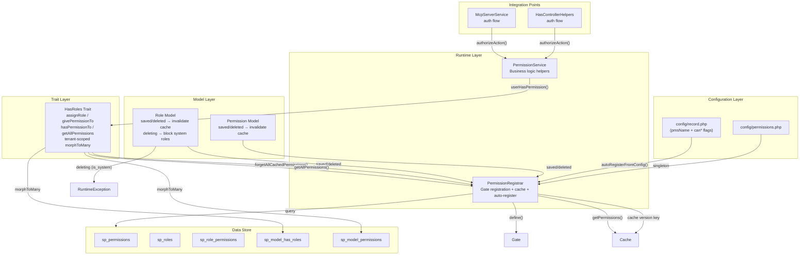
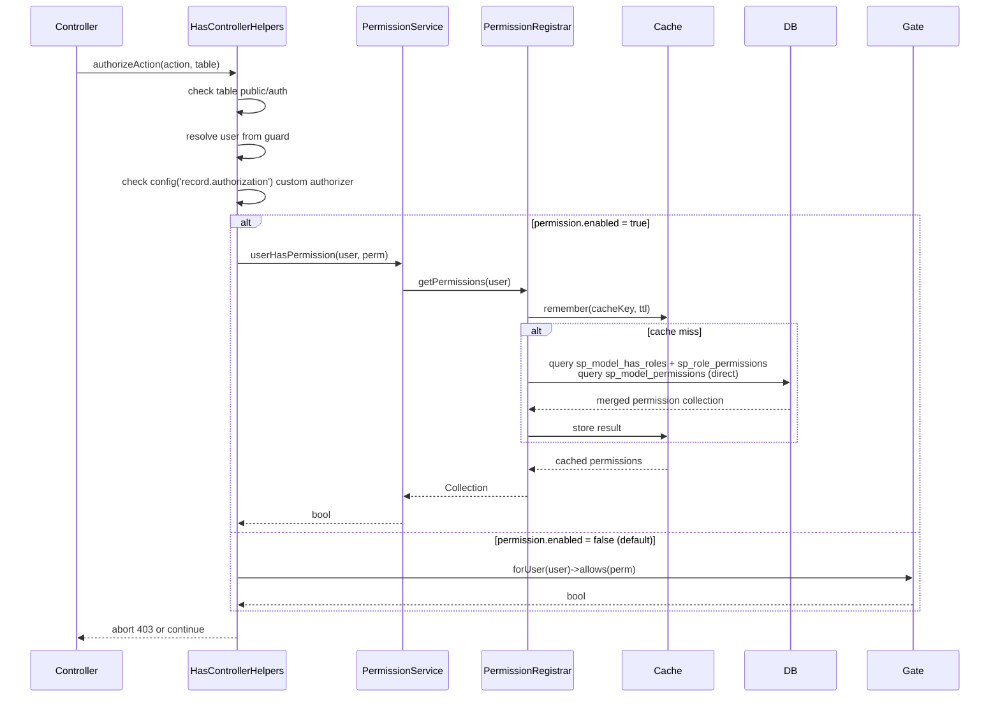
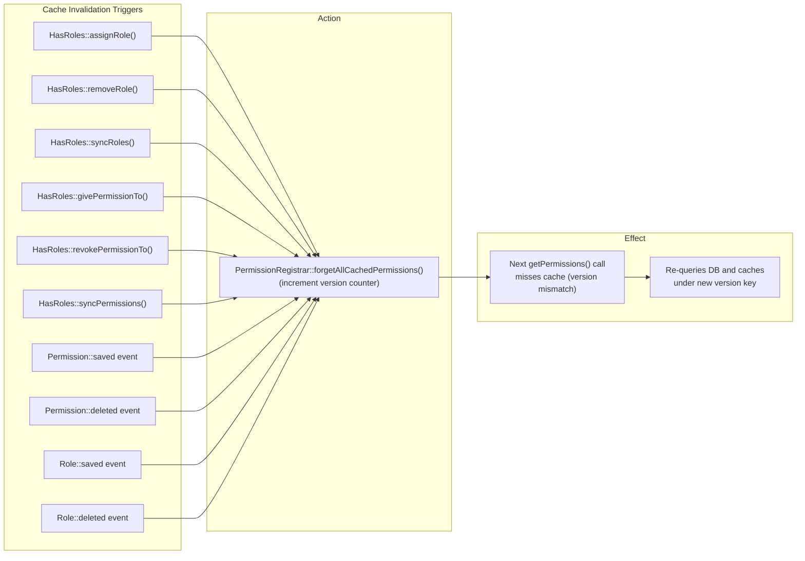

# Built-in Role/Permission System

The package ships an **optional** built-in role/permission system at `Sopheak\Core\Authorization`. It is disabled by default — existing apps see zero change.

When enabled, it replaces the default `Gate::forUser()->allows()` flow with an integrated system that auto-registers permissions from `config/record.php`, caches resolved permissions per user via a version-based cache key, and provides a Spatie-compatible developer API.



---

## Configuration

### Enable

```bash
SP_PERMISSION_ENABLED=true
```

Or in `config/permissions.php`:

```php
'enabled' => true,
```

### Full Config Reference

```php
// config/permissions.php (published after php artisan vendor:publish --tag=sp-laravel-api-config)
return [
    'enabled'                 => env('SP_PERMISSION_ENABLED', false),
    'auto_register'           => env('SP_PERMISSION_AUTO_REGISTER', true),
    'auto_register_functions' => env('SP_PERMISSION_AUTO_REGISTER_FUNCTIONS', true),
    'cache_ttl'               => env('SP_PERMISSION_CACHE_TTL', 3600),
    'tenant_scoped'           => env('SP_PERMISSION_TENANT_SCOPED', false),
    'super_admin_callback'    => null, // fn ($user) => $user->tokenCan('super-admin') || $user->is_admin,
    'migrate_from_legacy'     => env('SP_PERMISSION_MIGRATE_FROM_LEGACY', false),
];
```

### Auto-Registration

When `auto_register = true`, the system scans **every table** in `config/record.php` on boot and creates permissions based on `pmsName` + `can*` flags:

| Config Flag | Permission Created |
|-------------|-------------------|
| `pmsName: 'invoice'`, `canRead: true` | `view:<separator>invoice` |
| `pmsName: 'invoice'`, `canCreate: true` | `create:<separator>invoice` |
| `pmsName: 'invoice'`, `canUpdate: true` | `update:<separator>invoice` |
| `pmsName: 'invoice'`, `canDelete: true` | `delete:<separator>invoice` |

Custom `permissions` maps on `RecordTableType` are also registered (e.g., `'read' => 'view_invoice'`).

### Config Hash Boot Optimization

`PermissionRegistrar::autoRegisterFromConfig()` computes a hash of relevant table config fields (`pmsName`, `canRead`, `canCreate`, `canUpdate`, `canDelete`, `permissions`, function `pmsName` entries) and caches it. On subsequent boots, if the hash matches, the entire registration loop is skipped — avoiding N+1 `firstOrCreate` queries on every request when config is unchanged.

---

## Architecture

### Component Overview

| Component | Namespace | Responsibility |
|-----------|-----------|----------------|
| `PermissionRegistrar` | `Sopheak\Core\Authorization` | Gate registration, user-level permission cache, config-driven auto-registration, version-based cache invalidation |
| `PermissionService` | `Sopheak\Core\Authorization` | Business logic helpers for permission/role queries and management |
| `Permission` (Model) | `Sopheak\Core\Authorization\Models` | Permission entity with `roles()` BelongsToMany; fires `saved`/`deleted` → invalidate cache |
| `Role` (Model) | `Sopheak\Core\Authorization\Models` | Role entity with `permissions()` BelongsToMany; fires `saved`/`deleted` → invalidate cache; `deleting` → blocks system role deletion |
| `HasRoles` (Trait) | `Sopheak\Core\Authorization\Traits` | Spatie-compatible trait: 16 public methods for role/permission assignment and querying; tenant-scoped morphToMany |

### Auth Flow



### Cache Invalidation Flow



---

## Super-Admin Bypass

Users who should have **unrestricted access** (e.g., root admins, Passport `super-admin` scope) can bypass the entire permission check without assigning every permission explicitly.

Configure a callback in `config/permissions.php`:

```php
'super_admin_callback' => fn ($user) => $user->tokenCan('super-admin') || $user->is_admin,
```

The callback receives the authenticated user and **must return `bool`**. When `true`, `authorizeAction()` returns immediately — no DB queries for roles/permissions are executed.

```php
// Default: null — all users must have explicit permissions
'super_admin_callback' => null,
```

The callback runs **after** authentication and permission name resolution but **before** the permission lookup loop. This means:
- Unauthenticated requests still get 401 (bypass only applies after `auth()->user()` resolves)
- Permission names are still resolved (for logging/debugging), but checking is skipped
- No Gate/DB queries are executed for bypassed users

### Example: Passport + Admin Flag

```php
'super_admin_callback' => function ($user) {
    // Passport token scope
    if ($user->tokenCan('super-admin')) {
        return true;
    }

    // Application-level admin flag
    if (!empty($user->is_admin)) {
        return true;
    }

    return false;
},
```

### Example: Check via Role Model

```php
use Sopheak\Core\Authorization\Models\Role;

'super_admin_callback' => function ($user) {
    return $user->hasRole('super-admin');
},
```

> **Note:** The role-based example above queries the DB every request — it partially defeats the purpose of the bypass. Prefer scope/attribute-based checks when possible.

---

## Tables

Five tables are created by the migration `2026_05_13_000000_create_sp_permissions_tables.php`:

| Table | Purpose |
|-------|---------|
| `sp_permissions` | Permission registry (id, name, group, guard_name, description) |
| `sp_roles` | Role definitions (id, name, key, guard_name, description, is_system, is_master, is_default, tenant_id*) |
| `sp_role_permissions` | Role ↔ Permission pivot (role_id, permission_id, tenant_id*) |
| `sp_model_has_roles` | Polymorphic model ↔ Role pivot (model_type, model_id, role_id, tenant_id) |
| `sp_model_permissions` | Polymorphic model ↔ Permission pivot (model_type, model_id, permission_id, tenant_id) |

`sp_permissions` and `sp_roles` are auto-exposed as CRUD endpoints via `RecordTableType`:
- `sp_permissions`: `canCreate: false` (auto-registered), `canUpdate: true`, `canDelete: false`
- `sp_roles`: `canCreate: true`, `canUpdate: true`, `canDelete: true`

*`tenant_id` is only added when `record.enable_tenant_id = true`. See [multi-tenant config](#tenant-scoping) below.

---

## Full API Reference

### PermissionRegistrar

Service class registered as a singleton in the container. Manages Gate registration, user-level permission caching, and config-driven auto-registration.

**Signature:**

```php
class PermissionRegistrar
{
    public function registerPermissions(): void;
    public function autoRegisterFromConfig(): void;
    public function getCacheVersion(): int;
    public function getPermissions(Model $user): Collection;
    public function forgetPermissions(Model $user): void;
    public function forgetAllCachedPermissions(): void;
}
```

| Method | Description |
|--------|-------------|
| `registerPermissions()` | Registers every row in `sp_permissions` as a Gate ability via `$gate->define()`. The Gate callback checks `$user->hasPermissionTo($permission->name)` when the user model uses the `HasRoles` trait. |
| `autoRegisterFromConfig()` | Scans `config('record.tables')` for `pmsName` + `can*` flags and calls `firstOrCreate` on `sp_permissions` for each permission. Also processes `RecordTableType::$permissions` custom maps and `RecordFunctionType` entries with `pmsName`. Skips when config hash matches cached hash. |
| `getCacheVersion()` | Returns the current cache version number (int). Initializes to `1` on first call. Used as part of the user-level cache key. |
| `getPermissions(Model $user)` | Returns a deduplicated `Collection` of all permissions for the user (merged from role-based + direct). Cached per user under a version-scoped key. |
| `forgetPermissions(Model $user)` | Removes the cached permission collection for a single user. |
| `forgetAllCachedPermissions()` | Increments the cache version counter. All existing cached permission entries become stale (version mismatch) and are ignored. Does **not** flush the entire cache store — preserves other query caches. |

**Cache key format:**

```
sp_permissions_v{version}_user_{class}_{id}_{tenantId?}
```

Example: `sp_permissions_v2_user_App\Models\User_1`

### PermissionService

Business logic facade for permission/role management. Injectable or resolved via `app(PermissionService::class)`.

**Signature:**

```php
class PermissionService
{
    public function isBuiltInPermissionEnabled(): bool;
    public function userHasTrait(Model $user): bool;
    public function userHasPermission(Model $user, string $permission): bool;
    public function userHasAnyPermission(Model $user, array $permissions): bool;
    public function userHasAllPermissions(Model $user, array $permissions): bool;
    public function userHasRole(Model $user, string $role): bool;
    public function getAllPermissionsForUser(Model $user): Collection;

    public function createRole(string $name, string $guardName, ?string $description, bool $isSystem): Role;
    public function findOrCreateRole(string $name, string $guardName, ?string $description): Role;
    public function createPermission(string $name, ?string $group, string $guardName, ?string $description): Permission;
    public function findOrCreatePermission(string $name, ?string $group, string $guardName, ?string $description): Permission;

    public function assignRoleToUser(Model $user, string $roleName): bool;
    public function givePermissionToUser(Model $user, string $permissionName): bool;
    public function syncUserRoles(Model $user, array $roleNames): bool;
    public function syncUserPermissions(Model $user, array $permissionNames): bool;
}
```

| Method | Description |
|--------|-------------|
| `isBuiltInPermissionEnabled()` | Returns `config('permission.enabled', false)`. Used by integration points (`HasControllerHelpers`, `McpServerService`) to decide which auth flow to use. |
| `userHasTrait(Model $user)` | Checks if the user model uses the `HasRoles` trait via `class_uses_recursive()`. |
| `userHasPermission()` | Delegates to `$user->hasPermissionTo()`. Returns `false` if user lacks trait. |
| `userHasAnyPermission()` | Delegates to `$user->hasAnyPermission()`. |
| `userHasAllPermissions()` | Delegates to `$user->hasAllPermissions()`. |
| `userHasRole()` | Delegates to `$user->hasRole()`. |
| `getAllPermissionsForUser()` | Delegates to `$user->getAllPermissions()`. Returns empty collection if user lacks trait. |
| `createRole()` | Creates a new `sp_roles` row. Passing `isSystem: true` protects it from deletion. |
| `findOrCreateRole()` | First-or-create lookup by name. |
| `createPermission()` | Creates a new `sp_permissions` row. |
| `findOrCreatePermission()` | First-or-create lookup by name. |
| `assignRoleToUser()` | Finds role by name and calls `$user->assignRole()`. Returns `false` if role not found or user lacks trait. |
| `givePermissionToUser()` | Finds permission by name and calls `$user->givePermissionTo()`. |
| `syncUserRoles()` | Calls `$user->syncRoles()` by name array. |
| `syncUserPermissions()` | Calls `$user->syncPermissions()` by name array. |

### HasRoles Trait

Add to any Eloquent model (typically `User`). Provides 16 public methods with Spatie-compatible signatures.

**Signature:**

```php
trait HasRoles
{
    // Relations
    public function roles(): MorphToMany;
    public function permissions(): MorphToMany;

    // Role assignment
    public function assignRole(string|array|Role ...$roles): static;
    public function removeRole(string|array|Role ...$roles): static;
    public function syncRoles(string|array|Role ...$roles): static;

    // Role queries
    public function hasRole(string|array|Role $role): bool;
    public function hasAnyRole(string|array|Role ...$roles): bool;
    public function hasAllRoles(string|array|Role ...$roles): bool;

    // Direct permission assignment
    public function givePermissionTo(string|array|Permission ...$permissions): static;
    public function revokePermissionTo(string|array|Permission ...$permissions): static;
    public function syncPermissions(string|array|Permission ...$permissions): static;

    // Permission queries
    public function hasPermissionTo(string|Permission $permission): bool;
    public function hasAnyPermission(string|array|Permission ...$permissions): bool;
    public function hasAllPermissions(string|array|Permission ...$permissions): bool;
    public function getAllPermissions(): Collection;
}
```

| Method | Description |
|--------|-------------|
| `roles()` | `MorphToMany` relation to `sp_roles` via `sp_model_has_roles` pivot. Auto-filters by `tenant_id` when `permission.tenant_scoped = true`. |
| `permissions()` | `MorphToMany` relation to `sp_permissions` via `sp_model_permissions` pivot (direct permissions only, not role-inherited). Auto-filters by `tenant_id` when scoped. |
| `assignRole()` | Syncs role IDs without detaching existing ones. Calls `forgetAllCachedPermissions()`. Accepts string name(s), Role instance(s), or array. |
| `removeRole()` | Detaches role IDs. Calls `forgetAllCachedPermissions()`. |
| `syncRoles()` | Replaces all role assignments with the given set. Calls `forgetAllCachedPermissions()`. |
| `hasRole()` | Checks for a single role by name (or array — any match). |
| `hasAnyRole()` | Returns `true` if the user has any of the given roles. |
| `hasAllRoles()` | Returns `true` if the user has all of the given roles. |
| `givePermissionTo()` | Syncs direct permission IDs without detaching. Calls `forgetAllCachedPermissions()`. |
| `revokePermissionTo()` | Detaches direct permission IDs. Calls `forgetAllCachedPermissions()`. |
| `syncPermissions()` | Replaces all direct permissions. Calls `forgetAllCachedPermissions()`. |
| `hasPermissionTo()` | Checks permission via `getAllPermissions()` (merged from roles + direct). Returns `bool`. |
| `hasAnyPermission()` | Checks if user has any of the given permission names. |
| `hasAllPermissions()` | Checks if user has all of the given permission names. |
| `getAllPermissions()` | Fetches from `PermissionRegistrar::getPermissions()` (cached, merged role + direct). |

**Role model methods** (on `Sopheak\Core\Authorization\Models\Role`):

| Method | Description |
|--------|-------------|
| `permissions()` | `BelongsToMany` to `Permission` via `sp_role_permissions`. |
| `hasPermissionTo(string $permission): bool` | Checks if the role has a specific permission. |
| `givePermissionTo(string|array $permissions): static` | Attaches permissions to the role. |
| `revokePermissionTo(string|array $permissions): static` | Detaches permissions from the role. |
| `syncPermissions(array $permissions): static` | Replaces all permissions on the role. |

---

## Role System Role Protection

Roles with `is_system = true` **cannot be deleted**. The `Role` model registers a `deleting` event that throws `\RuntimeException` when a system role is deleted:

```php
$role = Role::query()->create(['name' => 'superadmin', 'guard_name' => 'api', 'is_system' => true]);
$role->delete(); // throws RuntimeException: "Cannot delete system role: superadmin"
```

Non-system roles (`is_system = false` or unset) can be deleted normally.

---

## Cache Invalidation

### Version-Based Cache

The `PermissionRegistrar` uses a **version-based cache key** instead of flushing the entire cache store:

- A `sp_permissions_version` counter is stored in the cache (initialized to `1`).
- Every user's permission cache key includes the current version: `sp_permissions_v{version}_user_{class}_{id}`.
- When permissions change, `forgetAllCachedPermissions()` increments the version counter.
- Subsequent `getPermissions()` calls miss the cache (version mismatch) and re-query the database, storing the result under the new version key.
- Old cache entries for previous versions are naturally ignored and expire via TTL — no cache store flushing needed.

### When Cache Is Invalidated

The version counter is incremented (invalidating all cached permissions) by:

| Trigger | Source |
|---------|--------|
| `Permission::saved` event | Model `booted()` — fires on create or update |
| `Permission::deleted` event | Model `booted()` |
| `Role::saved` event | Model `booted()` — fires on create or update |
| `Role::deleted` event | Model `booted()` |
| `HasRoles::assignRole()` | Trait method — explicit call |
| `HasRoles::removeRole()` | Trait method — explicit call |
| `HasRoles::syncRoles()` | Trait method — explicit call |
| `HasRoles::givePermissionTo()` | Trait method — explicit call |
| `HasRoles::revokePermissionTo()` | Trait method — explicit call |
| `HasRoles::syncPermissions()` | Trait method — explicit call |

---

## Performance

The permission system is optimized for the authorization hot path (every CRUD request):

| Optimization | Detail |
|-------------|--------|
| **Name-only caching** | `getPermissions()` caches only permission name strings (not full Eloquent models). Cache memory footprint is ~6x smaller, with no model serialization overhead. |
| **Version-based invalidation** | Permission changes increment a version counter instead of flushing the entire cache store. Old entries expire naturally via TTL. |
| **Config hash skip** | `autoRegisterFromConfig()` computes a hash of table config and skips `firstOrCreate` queries on repeated boots when config is unchanged. |
| **Pluck queries** | `registerPermissions()` and `getPermissions()` use `->pluck('name')` instead of `->get()` — only the `name` column is transferred from the database. |
| **Exists checks** | `PermissionService::assignRoleToUser()` and `givePermissionToUser()` use `->exists()` instead of loading full Eloquent models. |

The `getPermissions()` result is cached per user under a version-scoped key, so the database is queried at most once per cache TTL (default 3600s) per user.

---

## Usage

### Add to User Model

```php
use Sopheak\Core\Authorization\Traits\HasRoles;

class User extends Authenticatable
{
    use HasRoles;
}
```

### Role Methods

```php
$user->assignRole('admin');                   // by name
$user->assignRole($role);                     // by Role instance
$user->assignRole(['admin', 'editor']);       // array

$user->removeRole('admin');

$user->syncRoles(['admin', 'editor']);

$user->hasRole('admin');                      // bool
$user->hasAnyRole(['admin', 'editor']);       // bool
$user->hasAllRoles(['admin', 'editor']);      // bool

$user->roles();                               // MorphToMany relation
```

### Permission Methods

```php
$user->givePermissionTo('view:invoice');
$user->givePermissionTo($permission);
$user->givePermissionTo(['view:invoice', 'create:invoice']);

$user->revokePermissionTo('view:invoice');
$user->syncPermissions(['view:invoice']);

$user->hasPermissionTo('view:invoice');        // bool (checks roles + direct)
$user->hasAnyPermission(['view:invoice', 'create:invoice']);
$user->hasAllPermissions(['view:invoice', 'create:invoice']);

$user->getAllPermissions();                    // Collection (merged from roles + direct)
$user->permissions();                          // MorphToMany relation (direct only)
```

### Role Model Methods

```php
$role = Role::query()->where('name', 'admin')->first();

$role->givePermissionTo('view:invoice');
$role->revokePermissionTo('view:invoice');
$role->syncPermissions(['view:invoice', 'create:invoice']);
$role->hasPermissionTo('view:invoice');        // bool
$role->permissions();                          // BelongsToMany relation
```

### PermissionService (Business Logic Layer)

```php
use Sopheak\Core\Authorization\PermissionService;

$service = app(PermissionService::class);

// Queries
$service->isBuiltInPermissionEnabled();         // bool
$service->userHasPermission($user, 'view:invoice');
$service->userHasAnyPermission($user, ['view:invoice', 'create:invoice']);
$service->userHasAllPermissions($user, ['view:invoice', 'create:invoice']);
$service->userHasRole($user, 'admin');
$service->getAllPermissionsForUser($user);      // Collection

// Management
$role = $service->createRole('editor', 'api', 'Editor role', false);
$service->assignRoleToUser($user, 'editor');
$service->syncUserRoles($user, ['admin', 'editor']);

$perm = $service->findOrCreatePermission('view:invoice', 'invoice');
$service->givePermissionToUser($user, 'view:invoice');
$service->syncUserPermissions($user, ['view:invoice', 'create:invoice']);
```

---

## Tenant Scoping

When `permission.tenant_scoped = true`, the `tenant_id` column on `sp_model_has_roles` and `sp_model_permissions` is used to scope assignments per tenant.

The `HasRoles` trait applies `wherePivot($tenantColumn, $tenantId)` on both `roles()` and `permissions()` morphToMany relations automatically.

The `PermissionRegistrar` includes the tenant ID in the cache key:

```
sp_permissions_v{version}_user_{class}_{id}_{tenantId}
```

**Tenant resolution priority** (in `HasRoles::resolveTenantId()`):

1. `$model->tenant_id` property (if it exists)
2. `request->attributes->get('resolved_tenant_id')`
3. `request->attributes->get('record_context')['tenant_id']`
4. Tenant header from `RecordConfigService::tenantHeader()`

When `tenant_scoped = false` (default), `tenant_id` is nullable and unused — roles/permissions are global.

---

## Migration from Legacy Permission Tables

If you have existing permission tables from `spatie/laravel-permission` (or any legacy system with the same structure: `permissions`, `roles`, `model_has_permissions`, `model_has_roles`, `role_has_permissions`), you can migrate the data:

```bash
php artisan sp-laravel-api:migrate-from-legacy
```

This command:
1. Reads from legacy tables (`permissions`, `roles`, `model_has_permissions`, `model_has_roles`, `role_has_permissions`)
2. Writes data into `sp_*` tables, preserving all relationships
3. Infers `group` from permission naming convention (e.g., `view:invoice` → group `invoice`)
4. Maps legacy `team_foreign_key` → `tenant_id` when multi-tenant is enabled (uses `RecordConfigService::tenantColumn()`)
5. **Never modifies or drops** legacy tables — safe rollback path

Safe to run multiple times (idempotent). Requires `migrate_from_legacy = true` in config (or `--force` flag).

### Multi-Company / Tenant-Scoped Roles

When migrating roles with duplicate names across companies (e.g., Company A and Company B both have "Property Admin"), the command uses `(name, team_foreign_key)` as the identity pair when multi-tenant is enabled:

```php
// config/record.php
'enable_tenant_id' => true,
'tenant_column' => 'company_id',
```

Each role receives its own row in `sp_roles` with the scoped tenant column. The `key` column auto-generates unique slugs per tenant on creation.

```bash
SP_PERMISSION_ENABLED=true SP_PERMISSION_MIGRATE_FROM_LEGACY=true php artisan sp-laravel-api:migrate-from-legacy
```

### Custom Columns

Legacy `roles` table columns (`is_master`, `is_default`, `key`) are **not** auto-mapped by the migration command — they are specific to the new built-in schema. If your legacy `roles` table has these columns, you'll need a custom migration script to copy them. Otherwise, they default to `false`/`null` and can be updated after migration.

### Updating `config/record.php` Relationship Definitions

If your `config/record.php` uses `RecordSpatiePermissionType` to define role/permission relationships (e.g., for exposing them via the dynamic API), replace them with the built-in equivalent.

**Before (Spatie integration):**

```php
use Sopheak\Core\Types\RecordSpatiePermissionType;

'users' => new RecordTableType(
    table: 'users',
    pmsName: 'user',
    // ...
    relationships: [
        'roles' => new RecordSpatiePermissionType(
            related: 'roles',
            relation: User::class,
            table: config('permission.table_names.model_has_roles'),
            foreignPivotKey: config('permission.column_names.model_morph_key'),
            relatedPivotKey: 'role_id',
            parentKey: 'id',
            relatedKey: 'id',
            teamsEnabled: config('permission.teams', false),
        ),
        'permissions' => new RecordSpatiePermissionType(
            related: 'permissions',
            relation: User::class,
            table: config('permission.table_names.model_has_permissions'),
            foreignPivotKey: config('permission.column_names.model_morph_key'),
            relatedPivotKey: 'permission_id',
            parentKey: 'id',
            relatedKey: 'id',
            teamsEnabled: config('permission.teams', false),
        ),
    ],
),
```

**Option A — Remove the relationship entries entirely (recommended):**

Add the `HasRoles` trait to your User model instead. The `roles()` and `permissions()` morphToMany relations are defined in the trait — no config entry needed.

```php
use Sopheak\Core\Authorization\Traits\HasRoles;

class User extends Authenticatable
{
    use HasRoles;
}
```

Then remove the `relationships` entries from `config/record.php`. All role/permission methods (`assignRole()`, `hasRole()`, `givePermissionTo()`, `getAllPermissions()`, etc.) work via the trait.

**Option B — Use `RecordMorphToManyType` (keep relationship visible in dynamic API):**

```php
use Sopheak\Core\Authorization\Models\Role;
use Sopheak\Core\Authorization\Models\Permission;
use Sopheak\Core\Types\RecordMorphToManyType;

'users' => new RecordTableType(
    table: 'users',
    pmsName: 'user',
    // ...
    relationships: [
        'roles' => new RecordMorphToManyType(
            related: Role::class,
            relation: User::class,
            table: 'sp_model_has_roles',
            foreignPivotKey: 'model_id',
            relatedPivotKey: 'role_id',
            parentKey: 'id',
            relatedKey: 'id',
        ),
        'permissions' => new RecordMorphToManyType(
            related: Permission::class,
            relation: User::class,
            table: 'sp_model_permissions',
            foreignPivotKey: 'model_id',
            relatedPivotKey: 'permission_id',
            parentKey: 'id',
            relatedKey: 'id',
        ),
    ],
),
```

| Aspect | `RecordSpatiePermissionType` | `RecordMorphToManyType` |
|---|---|---|
| Target tables | Spatie's config-based table names | `sp_model_has_roles` / `sp_model_permissions` |
| `foreignPivotKey` | `config('permission.column_names.model_morph_key')` | `'model_id'` |
| `related` class | string `'roles'` | FQCN `Role::class` |
| `teamsEnabled` / `teamsKey` | reads Spatie config | not needed — built-in tenant scoping handled by `HasRoles` trait |

---


## Validating Setup

```bash
php artisan sp-laravel-api:validate
```

The validation command checks for:
- `sp_*` permission tables exist
- Permission system enabled/disabled status
- Detection of legacy permission tables with migration hint

---

## Real-World Example

```php
// 1. Enable in .env
// SP_PERMISSION_ENABLED=true
// php artisan migrate

// 2. Add trait to User model
use Sopheak\Core\Authorization\Traits\HasRoles;

class User extends Authenticatable
{
    use HasRoles;
}

// 3. Create a role
$role = Role::query()->create([
    'name' => 'editor',
    'guard_name' => 'api',
]);

// 4. Grant permissions to the role
// (permissions are auto-registered from config/record.php)
$role->givePermissionTo('view:invoice');
$role->givePermissionTo('create:invoice');
$role->givePermissionTo('update:invoice');

// 5. Assign role to user
$user = User::find(1);
$user->assignRole('editor');

// 6. Check at runtime
$user->hasPermissionTo('create:invoice'); // true
$user->hasPermissionTo('delete:invoice'); // false

// 7. Override for specific users (direct permission bypassing role)
$user->givePermissionTo('delete:invoice');

// 8. Combined check
$user->getAllPermissions(); // Collection of all permissions from roles + direct

// 9. Using PermissionService
$service = app(PermissionService::class);
$service->userHasPermission($user, 'create:invoice'); // true

// 10. System role protection
$systemRole = Role::query()->create([
    'name' => 'superadmin',
    'guard_name' => 'api',
    'is_system' => true,
]);
// $systemRole->delete(); // throws RuntimeException
```

---

## Related Docs

- `/guide/api/api-config-validation-triggers` — config-driven auth flow
- `/guide/api/api-type-reference-and-examples` — RecordTableType permission maps
- `/guide/features/feature-record-trigger-functions` — function-level permission checks
- `/guide/features/feature-permission-rls` — PostgreSQL RLS defense-in-depth
- `/advanced/troubleshooting` — permission debugging tips
