# sopheak/sp-jwt-auth Technical Specification

## Summary

`sopheak/sp-jwt-auth` is a reusable Laravel package for first-party API authentication using JWT access tokens and opaque rotating refresh tokens.

The package provides the generic authentication infrastructure: Laravel guard, token issuing, token validation, refresh rotation, revocation, scopes, token helpers, external identity adapter contracts, MFA challenge hooks, optional email/phone OTP verification, optional email account verification, optional password reset tokens, and optional API keys for integrations.

The package can also include an optional OAuth2 authorization server module for systems that need third-party API clients, consent screens, authorization-code + PKCE, client credentials, and OAuth-style client management. This module must be disabled by default so normal first-party SaaS authentication remains fast and simple.

Applications keep product-specific logic such as login credentials, registration, company selection, tenant rules, role assignment, Google2FA storage, audit logs, and social account linking.

## Goals

- Replace Passport for first-party API authentication.
- Support Laravel `auth:api` style guard usage.
- Support mixed Laravel web/API apps using Blade, Livewire, Inertia, controllers, route middleware, notifications, policies, and Eloquent user providers.
- Preserve Passport-like token helpers:
  - `$user->token()`
  - `$user->tokenCan($scope)`
- Support JWT access tokens with persisted `jti`.
- Support opaque refresh tokens with rotation and reuse detection.
- Support revoking one token, one session, or all tokens for a user.
- Support scopes and app-defined custom claims.
- Support Socialite and generic OIDC integrations through adapters.
- Support MFA through package contracts.
- Optionally support email and phone OTP challenges with hashed OTP storage and app-owned delivery.
- Optionally support email account verification with custom templates.
- Optionally support forgot-password email reset tokens with custom templates.
- Optionally support expirable API keys for client-managed third-party integrations.
- Optionally support full OAuth2 authorization server mode for third-party API clients.
- Work with Laravel 12 and Laravel 13.

## Non-Goals

- OAuth2 authorization server features are not part of the default first-party JWT flow.
- OAuth2 server mode is optional and must not be required by apps that only need first-party JWT auth.
- No built-in user registration endpoint.
- No built-in password login endpoint.
- No forced login identifier; apps may authenticate by email, username, phone, employee id, or any custom identifier before passing the resolved user to the package.
- No built-in password update implementation; the app owns password hashing and policy.
- No direct dependency on `sopheak/sp-laravel-api`.
- No SpeedX-specific company or tenant logic.
- No SAML in v1.

## Modular Release Roadmap

The package must be implemented as modular capabilities, not one large required feature set. Each module must have separate config, migrations, service bindings, tests, and documentation.

| Version | Module | Scope | Required By Default |
| --- | --- | --- | --- |
| `v1.0` | Core JWT | JWT guard, access tokens, rotating refresh tokens, revocation, scopes, claims, token context, key rotation, lifecycle events, developer hooks. | Yes |
| `v1.1` | Account Security | MFA challenge broker, email/phone OTP, email verification, forgot-password reset tokens, recovery code extension point, rate-limit hooks. | No |
| `v1.2` | SaaS Integrations | API keys, tenant/subject resolver contracts, session/device management, structured audit payloads. | No |
| `v2.0` | External Identity | Socialite, generic OIDC, passkey/WebAuthn extension contracts. | No |
| `v2.1` | OAuth2 Server | OAuth2 authorization server, clients, consent, authorization-code + PKCE, client credentials, resource-server guard. | No |

Module rules:

- Core JWT must install and run without optional modules.
- Optional modules must not publish migrations unless enabled or explicitly installed.
- Optional dependencies must remain in Composer `suggest` unless the module cannot function without a hard dependency.
- Apps must be able to enable modules incrementally without changing existing token behavior.
- Public APIs for stable modules must not depend on experimental modules.

## Tech Stack

- PHP: `^8.3|^8.4|^8.5`
- Laravel: `^12.0|^13.0`
- JWT library: `firebase/php-jwt:^7.0`
- Laravel web stack: Blade, Livewire, Inertia, Laravel Notifications, Gates/Policies, Eloquent providers
- Optional social provider integration: `laravel/socialite:^5.27`
- Optional community provider integration: `socialiteproviders/manager:^4.9`
- Optional generic OAuth/OIDC base: `league/oauth2-client:^2.9`
- Optional OAuth2 authorization server: `league/oauth2-server:^9.3`
- Tests: Orchestra Testbench `^10|^11`

## Package Boundaries

The package owns:

- JWT guard registration
- Access token signing and validation
- Refresh token issuing and rotation
- Token storage models and migrations
- Token scopes and claims
- Revocation APIs
- External identity normalization
- MFA challenge contracts
- Optional email/phone OTP challenge broker
- Optional email account verification broker
- Optional forgot-password token broker
- Optional API key issuing and validation
- Developer extension hooks and lifecycle events
- Artisan maintenance commands
- Laravel web/API integration helpers
- Optional OAuth2 authorization server module
- Optional OAuth2 client registry, consent, and grant handling

The application owns:

- Password login
- Login identifier policy: email, username, phone, employee id, or custom field
- Registration
- User creation
- Company/tenant selection
- Role and permission mapping
- Google2FA secret storage
- Email/SMS/voice/WhatsApp delivery provider selection
- Email template design and branding
- Password complexity rules and password update persistence
- Hook implementations for product-specific rules
- Blade, Livewire, Inertia, or controller UI screens
- Laravel Notification classes and mail templates
- Social account linking policy
- Audit logging
- HTTP response shape customization
- OAuth consent UI rendering and approval UX
- Business rules for which users/tenants can authorize OAuth clients

## Architecture Diagram

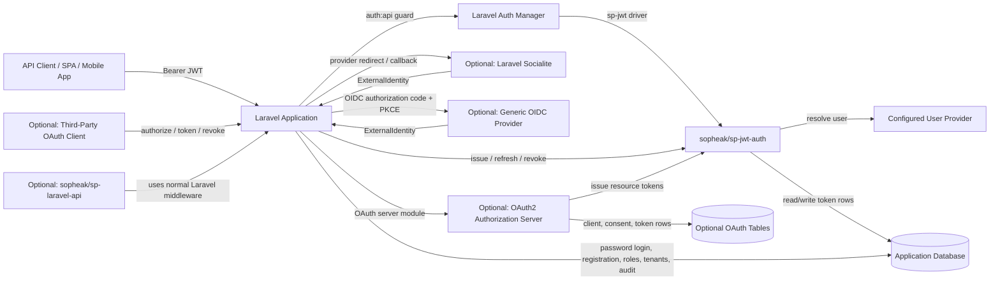

This boundary keeps `sopheak/sp-jwt-auth` reusable. The package owns token infrastructure; the consuming application owns product authentication decisions and HTTP response shape.

## Composer Package

Package name:

```json
{
  "name": "sopheak/sp-jwt-auth",
  "type": "library",
  "require": {
    "php": "^8.3|^8.4|^8.5",
    "firebase/php-jwt": "^7.0",
    "laravel/framework": "^12.0|^13.0"
  },
  "suggest": {
    "laravel/socialite": "Required for Socialite provider login support.",
    "socialiteproviders/manager": "Required for community Socialite providers.",
    "league/oauth2-client": "Required for generic OAuth2/OIDC adapters.",
    "league/oauth2-server": "Required for optional OAuth2 authorization server support."
  }
}
```

## Configuration

Publish `config/sp-jwt-auth.php`.

```php
return [
    'guard' => env('SP_JWT_GUARD', 'api'),
    'driver' => env('SP_JWT_DRIVER', 'sp-jwt'),
    'user_provider' => env('SP_JWT_USER_PROVIDER', 'users'),

    'issuer' => env('SP_JWT_ISSUER', env('APP_URL')),
    'audience' => env('SP_JWT_AUDIENCE'),

    'algorithm' => env('SP_JWT_ALGORITHM', 'RS256'),
    'key_id' => env('SP_JWT_KEY_ID'),
    'private_key' => env('SP_JWT_PRIVATE_KEY'),
    'public_key' => env('SP_JWT_PUBLIC_KEY'),
    'private_key_path' => env('SP_JWT_PRIVATE_KEY_PATH', storage_path('jwt-private.key')),
    'public_key_path' => env('SP_JWT_PUBLIC_KEY_PATH', storage_path('jwt-public.key')),
    'keys' => [
        'active_kid' => env('SP_JWT_ACTIVE_KID', env('SP_JWT_KEY_ID')),
        'previous_kids' => array_filter(explode(',', env('SP_JWT_PREVIOUS_KIDS', ''))),
        'jwks_enabled' => env('SP_JWT_JWKS_ENABLED', true),
        'jwks_route' => env('SP_JWT_JWKS_ROUTE', '/.well-known/sp-jwt-auth/jwks.json'),
        'rotation_grace_days' => env('SP_JWT_KEY_ROTATION_GRACE_DAYS', 30),
    ],

    'access_ttl_minutes' => env('SP_JWT_ACCESS_TTL_MINUTES', 15),
    'refresh_ttl_days' => env('SP_JWT_REFRESH_TTL_DAYS', 60),
    'clock_skew_seconds' => env('SP_JWT_CLOCK_SKEW_SECONDS', 60),

    'refresh_hash_key' => env('SP_JWT_REFRESH_HASH_KEY'),
    'rotate_refresh_tokens' => true,
    'reuse_detection' => 'revoke_session',

    'external_identities' => [
        'store_provider_tokens' => false,
        'encrypt_provider_tokens' => true,
    ],

    'login' => [
        'identifier_mode' => env('SP_JWT_LOGIN_IDENTIFIER_MODE', 'email_or_username'),
        'identifiers' => [
            'email',
            'username',
        ],
        'password_field' => env('SP_JWT_LOGIN_PASSWORD_FIELD', 'password'),
    ],

    'mfa' => [
        'enabled' => false,
        'challenge_ttl_minutes' => 5,
        'otp' => [
            'enabled' => false,
            'ttl_minutes' => 5,
            'digits' => 6,
            'max_attempts' => 5,
            'resend_cooldown_seconds' => 60,
            'channels' => [
                'email',
                'phone',
            ],
            'hash_key' => env('SP_JWT_OTP_HASH_KEY'),
            'notification' => [
                'template' => env('SP_JWT_OTP_TEMPLATE', 'sp-jwt-auth::mail.otp-code'),
                'sender' => env('SP_JWT_OTP_SENDER', 'mail'),
            ],
        ],
    ],

    'email_verification' => [
        'enabled' => env('SP_JWT_EMAIL_VERIFICATION_ENABLED', false),
        'ttl_minutes' => env('SP_JWT_EMAIL_VERIFICATION_TTL_MINUTES', 60),
        'hash_key' => env('SP_JWT_EMAIL_VERIFICATION_HASH_KEY'),
        'notification' => [
            'template' => env('SP_JWT_EMAIL_VERIFICATION_TEMPLATE', 'sp-jwt-auth::mail.email-verification'),
            'sender' => env('SP_JWT_EMAIL_VERIFICATION_SENDER', 'mail'),
        ],
    ],

    'password_reset' => [
        'enabled' => env('SP_JWT_PASSWORD_RESET_ENABLED', false),
        'ttl_minutes' => env('SP_JWT_PASSWORD_RESET_TTL_MINUTES', 60),
        'hash_key' => env('SP_JWT_PASSWORD_RESET_HASH_KEY'),
        'max_attempts' => 5,
        'notification' => [
            'template' => env('SP_JWT_PASSWORD_RESET_TEMPLATE', 'sp-jwt-auth::mail.password-reset'),
            'sender' => env('SP_JWT_PASSWORD_RESET_SENDER', 'mail'),
        ],
    ],

    'api_keys' => [
        'enabled' => env('SP_JWT_API_KEYS_ENABLED', false),
        'prefix' => env('SP_JWT_API_KEY_PREFIX', 'spak'),
        'environment' => env('SP_JWT_API_KEY_ENVIRONMENT', 'live'),
        'hash_key' => env('SP_JWT_API_KEY_HASH_KEY'),
        'default_ttl_days' => env('SP_JWT_API_KEY_DEFAULT_TTL_DAYS'),
        'max_ttl_days' => env('SP_JWT_API_KEY_MAX_TTL_DAYS', 365),
        'allow_never_expires' => env('SP_JWT_API_KEY_ALLOW_NEVER_EXPIRES', false),
        'public_id_length' => 16,
        'secret_bytes' => 32,
    ],

    'oauth_server' => [
        'enabled' => env('SP_JWT_OAUTH_SERVER_ENABLED', false),
        'route_prefix' => env('SP_JWT_OAUTH_ROUTE_PREFIX', 'oauth'),
        'access_token_format' => env('SP_JWT_OAUTH_ACCESS_TOKEN_FORMAT', 'opaque'),
        'resource_validation' => env('SP_JWT_OAUTH_RESOURCE_VALIDATION', 'database'),
        'authorization_code_ttl_minutes' => 10,
        'access_ttl_minutes' => 15,
        'refresh_ttl_days' => 60,
        'require_pkce_for_public_clients' => true,
        'allowed_grants' => [
            'authorization_code',
            'refresh_token',
            'client_credentials',
        ],
        'device_code_grant' => [
            'enabled' => false,
            'user_code_ttl_minutes' => 10,
        ],
        'consent' => [
            'remember_approved_clients' => true,
            'default_prompt' => 'consent',
        ],
    ],
];
```

## Database Tables

### `sp_jwt_access_tokens`

Stores issued JWT access token records.

Columns:

- `id` UUID primary key, used as JWT `jti`
- `user_type` string
- `user_id` unsigned bigint or string-compatible morph id
- `session_id` nullable UUID
- `device_id` nullable string
- `subject_type` nullable string
- `subject_id` nullable string
- `scopes` JSON
- `claims` JSON
- `issuer` string
- `audience` nullable string
- `last_used_at` nullable timestamp
- `revoked_at` nullable timestamp
- `expires_at` timestamp
- timestamps

Indexes:

- `user_type`, `user_id`
- `session_id`
- `revoked_at`
- `expires_at`
- `subject_type`, `subject_id`

### `sp_jwt_refresh_tokens`

Stores opaque refresh tokens.

Columns:

- `id` UUID primary key
- `access_token_id` UUID
- `user_type` string
- `user_id`
- `session_id` nullable UUID
- `secret_hash` string
- `hash_key_id` nullable string
- `scopes` JSON
- `claims` JSON
- `replaced_by_id` nullable UUID
- `revoked_at` nullable timestamp
- `expires_at` timestamp
- timestamps

Rules:

- Refresh token returned to clients is `id.secret`.
- Only `secret_hash` is stored.
- Rotation updates `replaced_by_id`.

### `sp_jwt_external_identities`

Stores linked external provider identities.

Columns:

- `id`
- `user_type`
- `user_id`
- `provider`
- `provider_user_id`
- `email` nullable
- `email_verified_at` nullable
- `profile` JSON nullable
- `tokens_encrypted` text nullable
- timestamps

Unique index:

- `provider`, `provider_user_id`

## Data Table Design

All package tables use the `sp_jwt_` prefix to avoid collision with application auth tables. The package must support Laravel's normal Eloquent user providers, so user ownership is stored as a polymorphic pair instead of a hard foreign key to `users.id`.

### Table: `sp_jwt_access_tokens`

Purpose: stores the server-side record for every JWT access token. The JWT itself is signed and returned to the client, while this table allows revocation, session tracking, tenant context, and `jti` validation.

| Column | Type | Nullable | Index | Notes |
| --- | --- | --- | --- | --- |
| `id` | `uuid` | No | Primary | JWT `jti`; generated by package. |
| `user_type` | `string(255)` | No | Composite | Authenticatable class name, e.g. `App\Models\User`. |
| `user_id` | `string(64)` | No | Composite | String-compatible to support integer, UUID, ULID user keys. |
| `session_id` | `uuid` | No | Yes | Groups access/refresh token family for one login session. |
| `device_id` | `string(255)` | Yes | Yes | App-provided stable device/client identifier. |
| `device_name` | `string(255)` | Yes | No | Human-readable device name for session management UIs. |
| `subject_type` | `string(255)` | Yes | Composite | App-defined active subject type, e.g. `company`, `tenant`, `workspace`. |
| `subject_id` | `string(64)` | Yes | Composite | App-defined active subject id. |
| `scopes` | `json` | No | No | Array of token scopes/abilities. Default `[]`. |
| `claims` | `json` | No | No | Extra app-defined claims persisted for validation. Default `[]`. |
| `issuer` | `string(255)` | No | Yes | Expected JWT `iss`. |
| `audience` | `string(255)` | Yes | Yes | Expected JWT `aud`, if configured. |
| `ip_address` | `string(45)` | Yes | No | IPv4/IPv6 at issue time. |
| `user_agent` | `text` | Yes | No | User agent at issue time. |
| `last_used_at` | `timestamp` | Yes | Yes | Updated by guard after successful authentication. |
| `revoked_at` | `timestamp` | Yes | Yes | Non-null means token is invalid. |
| `expires_at` | `timestamp` | No | Yes | Access token expiry. |
| `created_at` | `timestamp` | Yes | No | Laravel timestamps. |
| `updated_at` | `timestamp` | Yes | No | Laravel timestamps. |

Required indexes:

| Name | Columns | Reason |
| --- | --- | --- |
| `sp_jwt_access_tokens_user_index` | `user_type`, `user_id` | Revoke/list all tokens for a user. |
| `sp_jwt_access_tokens_session_index` | `session_id` | Revoke one login session. |
| `sp_jwt_access_tokens_subject_index` | `subject_type`, `subject_id` | Optional app subject cleanup/reporting. |
| `sp_jwt_access_tokens_expiry_index` | `expires_at` | Prune expired access tokens. |
| `sp_jwt_access_tokens_revoked_index` | `revoked_at` | Query active/revoked tokens. |
| `sp_jwt_access_tokens_last_used_index` | `last_used_at` | Session management UI and stale-session cleanup. |

### Table: `sp_jwt_refresh_tokens`

Purpose: stores refresh token records. The client receives `id.secret`; only the HMAC hash of `secret` is stored. Each rotation creates a new row, revokes the old row, and links old to new through `replaced_by_id`.

| Column | Type | Nullable | Index | Notes |
| --- | --- | --- | --- | --- |
| `id` | `uuid` | No | Primary | Public refresh token id, first part of `id.secret`. |
| `access_token_id` | `uuid` | No | Foreign/index | Access token paired with this refresh token. |
| `user_type` | `string(255)` | No | Composite | Mirrors access token owner. |
| `user_id` | `string(64)` | No | Composite | Mirrors access token owner. |
| `session_id` | `uuid` | No | Yes | Same session family as access token. |
| `secret_hash` | `string(128)` | No | No | HMAC-SHA256 of refresh token secret. |
| `hash_key_id` | `string(100)` | Yes | Yes | HMAC key id used for `secret_hash`; required when hash-key rotation is enabled. |
| `scopes` | `json` | No | No | Scopes to carry into the next access token. |
| `claims` | `json` | No | No | Claims to carry into the next access token. |
| `replaced_by_id` | `uuid` | Yes | Yes | New refresh token id after rotation. |
| `revoked_at` | `timestamp` | Yes | Yes | Non-null means token is invalid/reused/rotated. |
| `expires_at` | `timestamp` | No | Yes | Refresh token expiry. |
| `created_at` | `timestamp` | Yes | No | Laravel timestamps. |
| `updated_at` | `timestamp` | Yes | No | Laravel timestamps. |

Required indexes:

| Name | Columns | Reason |
| --- | --- | --- |
| `sp_jwt_refresh_tokens_access_index` | `access_token_id` | Revoke refresh token when access token is revoked. |
| `sp_jwt_refresh_tokens_user_index` | `user_type`, `user_id` | Revoke/list all refresh tokens for a user. |
| `sp_jwt_refresh_tokens_session_index` | `session_id` | Revoke session token family. |
| `sp_jwt_refresh_tokens_replaced_index` | `replaced_by_id` | Trace token rotation chain. |
| `sp_jwt_refresh_tokens_expiry_index` | `expires_at` | Prune expired refresh tokens. |
| `sp_jwt_refresh_tokens_revoked_index` | `revoked_at` | Detect revoked/reused tokens quickly. |

### Table: `sp_jwt_external_identities`

Purpose: stores app user links to external identity providers. This table is optional but recommended for Socialite/OIDC login flows. The package never creates application users by itself; it only persists links after the consuming app approves the link.

| Column | Type | Nullable | Index | Notes |
| --- | --- | --- | --- | --- |
| `id` | `bigint unsigned` | No | Primary | Auto-increment id. |
| `user_type` | `string(255)` | No | Composite | Authenticatable class name. |
| `user_id` | `string(64)` | No | Composite | Authenticatable id. |
| `provider` | `string(100)` | No | Unique composite | Provider key, e.g. `google`, `apple`, `oidc:acme`. |
| `provider_user_id` | `string(255)` | No | Unique composite | Stable provider subject/id claim. |
| `email` | `string(255)` | Yes | Yes | Provider email, if returned. |
| `email_verified_at` | `timestamp` | Yes | No | Set when provider confirms email verification. |
| `display_name` | `string(255)` | Yes | No | Provider display name. |
| `avatar_url` | `text` | Yes | No | Provider avatar URL. |
| `profile` | `json` | Yes | No | Normalized non-secret provider profile fields. |
| `tokens_encrypted` | `text` | Yes | No | Encrypted provider token payload, only if enabled. |
| `last_login_at` | `timestamp` | Yes | Yes | Last successful login via this identity. |
| `created_at` | `timestamp` | Yes | No | Laravel timestamps. |
| `updated_at` | `timestamp` | Yes | No | Laravel timestamps. |

Required indexes:

| Name | Columns | Reason |
| --- | --- | --- |
| `sp_jwt_external_identities_provider_unique` | `provider`, `provider_user_id` | Prevent one external account linking to multiple local users. |
| `sp_jwt_external_identities_user_index` | `user_type`, `user_id` | List identities linked to one local user. |
| `sp_jwt_external_identities_email_index` | `email` | Optional account matching and support lookup. |
| `sp_jwt_external_identities_last_login_index` | `last_login_at` | Audit/reporting and stale identity cleanup. |

### Table: `sp_jwt_mfa_challenges`

Purpose: stores short-lived MFA challenge intent when the package's MFA broker is enabled. It stores token context, not passwords, OTP secrets, or provider proof values.

| Column | Type | Nullable | Index | Notes |
| --- | --- | --- | --- | --- |
| `id` | `uuid` | No | Primary | Challenge id returned to the app/client. |
| `user_type` | `string(255)` | No | Composite | Authenticatable class name. |
| `user_id` | `string(64)` | No | Composite | Authenticatable id. |
| `session_id` | `uuid` | No | Yes | Session that will receive tokens after MFA completion. |
| `context` | `json` | No | No | Serialized `TokenContext`; no secrets. |
| `methods` | `json` | No | No | Allowed MFA method names, e.g. `["totp","webauthn"]`. |
| `completed_at` | `timestamp` | Yes | Yes | Set once challenge is consumed. |
| `expires_at` | `timestamp` | No | Yes | Short TTL, default 5 minutes. |
| `created_at` | `timestamp` | Yes | No | Laravel timestamps. |
| `updated_at` | `timestamp` | Yes | No | Laravel timestamps. |

Required indexes:

| Name | Columns | Reason |
| --- | --- | --- |
| `sp_jwt_mfa_challenges_user_index` | `user_type`, `user_id` | Revoke/list pending challenges for a user. |
| `sp_jwt_mfa_challenges_session_index` | `session_id` | Bind challenge to login session intent. |
| `sp_jwt_mfa_challenges_expiry_index` | `expires_at` | Prune expired challenges. |
| `sp_jwt_mfa_challenges_completed_index` | `completed_at` | Reject challenge reuse. |

### Table: `sp_jwt_mfa_otp_codes`

Purpose: stores short-lived email/phone OTP proof records for an MFA challenge. The table never stores plaintext OTP values or unmasked destinations.

| Column | Type | Nullable | Index | Notes |
| --- | --- | --- | --- | --- |
| `id` | `uuid` | No | Primary | OTP code record id. |
| `challenge_id` | `uuid` | No | Foreign/index | Related `sp_jwt_mfa_challenges.id`. |
| `channel` | `string(30)` | No | Yes | `email`, `sms`, `voice`, `whatsapp`, or app-defined channel. |
| `destination_hash` | `string(128)` | No | Yes | HMAC hash of normalized email or phone. |
| `destination_masked` | `string(255)` | No | No | Safe display value, e.g. `s***@mail.com` or `+855******123`. |
| `code_hash` | `string(128)` | No | No | HMAC hash of OTP code with package OTP hash key. |
| `hash_key_id` | `string(100)` | Yes | Yes | HMAC key id used for `code_hash`; required when hash-key rotation is enabled. |
| `attempts` | `unsigned smallint` | No | No | Failed verification attempts. Default `0`. |
| `max_attempts` | `unsigned smallint` | No | No | Copied from config when issued. |
| `resend_count` | `unsigned smallint` | No | No | Number of resend attempts. Default `0`. |
| `last_sent_at` | `timestamp` | Yes | Yes | Enforces resend cooldown. |
| `verified_at` | `timestamp` | Yes | Yes | Set once OTP is successfully verified. |
| `expires_at` | `timestamp` | No | Yes | Short TTL, default 5 minutes. |
| `created_at` | `timestamp` | Yes | No | Laravel timestamps. |
| `updated_at` | `timestamp` | Yes | No | Laravel timestamps. |

Required indexes:

| Name | Columns | Reason |
| --- | --- | --- |
| `sp_jwt_mfa_otp_codes_challenge_index` | `challenge_id` | Load OTP proofs for one MFA challenge. |
| `sp_jwt_mfa_otp_codes_channel_index` | `channel` | Channel reporting and cleanup. |
| `sp_jwt_mfa_otp_codes_destination_index` | `destination_hash` | Rate-limit repeated sends to the same destination. |
| `sp_jwt_mfa_otp_codes_expiry_index` | `expires_at` | Prune expired OTP proofs. |
| `sp_jwt_mfa_otp_codes_verified_index` | `verified_at` | Reject OTP reuse. |

### Table: `sp_jwt_email_verification_tokens`

Purpose: stores short-lived account email verification tokens. The package never stores the plaintext verification token.

| Column | Type | Nullable | Index | Notes |
| --- | --- | --- | --- | --- |
| `id` | `uuid` | No | Primary | Verification token record id. |
| `user_type` | `string(255)` | No | Composite | Authenticatable class name. |
| `user_id` | `string(64)` | No | Composite | Authenticatable id. |
| `email_hash` | `string(128)` | No | Yes | HMAC hash of normalized email being verified. |
| `email_masked` | `string(255)` | No | No | Safe display value. |
| `token_hash` | `string(128)` | No | No | HMAC hash of plaintext verification token. |
| `hash_key_id` | `string(100)` | Yes | Yes | HMAC key id used for `token_hash`; required when hash-key rotation is enabled. |
| `metadata` | `json` | Yes | No | App-defined context such as locale or redirect path. |
| `sent_at` | `timestamp` | Yes | Yes | Last notification send time. |
| `verified_at` | `timestamp` | Yes | Yes | Set when token is consumed. |
| `expires_at` | `timestamp` | No | Yes | Default 60 minutes. |
| `created_at` | `timestamp` | Yes | No | Laravel timestamps. |
| `updated_at` | `timestamp` | Yes | No | Laravel timestamps. |

Required indexes:

| Name | Columns | Reason |
| --- | --- | --- |
| `sp_jwt_email_verification_tokens_user_index` | `user_type`, `user_id` | Find pending verification for a user. |
| `sp_jwt_email_verification_tokens_email_index` | `email_hash` | Rate-limit repeated sends to one email. |
| `sp_jwt_email_verification_tokens_expiry_index` | `expires_at` | Prune expired verification tokens. |
| `sp_jwt_email_verification_tokens_verified_index` | `verified_at` | Reject token reuse. |

### Table: `sp_jwt_password_reset_tokens`

Purpose: stores short-lived forgot-password reset tokens. The package validates the reset token and returns the intended user; the consuming app performs the actual password update.

| Column | Type | Nullable | Index | Notes |
| --- | --- | --- | --- | --- |
| `id` | `uuid` | No | Primary | Password reset token record id. |
| `user_type` | `string(255)` | No | Composite | Authenticatable class name. |
| `user_id` | `string(64)` | No | Composite | Authenticatable id. |
| `email_hash` | `string(128)` | No | Yes | HMAC hash of normalized email. |
| `email_masked` | `string(255)` | No | No | Safe display value. |
| `token_hash` | `string(128)` | No | No | HMAC hash of plaintext reset token. |
| `hash_key_id` | `string(100)` | Yes | Yes | HMAC key id used for `token_hash`; required when hash-key rotation is enabled. |
| `attempts` | `unsigned smallint` | No | No | Failed verification attempts. Default `0`. |
| `max_attempts` | `unsigned smallint` | No | No | Copied from config when issued. |
| `metadata` | `json` | Yes | No | App-defined context such as locale or redirect path. |
| `sent_at` | `timestamp` | Yes | Yes | Last notification send time. |
| `used_at` | `timestamp` | Yes | Yes | Set when token is consumed. |
| `expires_at` | `timestamp` | No | Yes | Default 60 minutes. |
| `created_at` | `timestamp` | Yes | No | Laravel timestamps. |
| `updated_at` | `timestamp` | Yes | No | Laravel timestamps. |

Required indexes:

| Name | Columns | Reason |
| --- | --- | --- |
| `sp_jwt_password_reset_tokens_user_index` | `user_type`, `user_id` | Revoke/list reset tokens for a user. |
| `sp_jwt_password_reset_tokens_email_index` | `email_hash` | Rate-limit reset requests to one email. |
| `sp_jwt_password_reset_tokens_expiry_index` | `expires_at` | Prune expired reset tokens. |
| `sp_jwt_password_reset_tokens_used_index` | `used_at` | Reject reset token reuse. |

### Table: `sp_jwt_api_keys`

Purpose: stores expirable opaque API keys for client-managed third-party integrations. This is simpler than OAuth2 when a SaaS tenant wants to create a scoped token for server-to-server API calls without user consent redirects.

| Column | Type | Nullable | Index | Notes |
| --- | --- | --- | --- | --- |
| `id` | `uuid` | No | Primary | API key record id. |
| `owner_type` | `string(255)` | No | Composite | App owner type, e.g. user, company, tenant, workspace. |
| `owner_id` | `string(64)` | No | Composite | App owner id. |
| `created_by_type` | `string(255)` | Yes | Composite | User/model that created the key. |
| `created_by_id` | `string(64)` | Yes | Composite | Creator id. |
| `name` | `string(255)` | No | No | Human-readable key name. |
| `prefix` | `string(30)` | No | Yes | Public prefix, e.g. `spak`. |
| `environment` | `string(30)` | No | Yes | `live`, `test`, `sandbox`, or app-defined environment. |
| `public_id` | `string(64)` | No | Unique | Public lookup id embedded in the key string. |
| `secret_hash` | `string(128)` | No | No | HMAC hash of opaque secret part only. |
| `hash_key_id` | `string(100)` | Yes | Yes | HMAC key id used for `secret_hash`; required when hash-key rotation is enabled. |
| `key_preview` | `string(30)` | No | No | Safe display preview, e.g. `spak_live_abc...xyz`. |
| `scopes` | `json` | No | No | Allowed API key scopes. |
| `claims` | `json` | No | No | App-defined context such as tenant/company id. |
| `allowed_ips` | `json` | Yes | No | Optional IP allowlist. |
| `last_used_at` | `timestamp` | Yes | Yes | Last successful API usage. |
| `revoked_at` | `timestamp` | Yes | Yes | Revoked keys are invalid. |
| `expires_at` | `timestamp` | Yes | Yes | Nullable only when `allow_never_expires` is true. |
| `created_at` | `timestamp` | Yes | No | Laravel timestamps. |
| `updated_at` | `timestamp` | Yes | No | Laravel timestamps. |

Required indexes:

| Name | Columns | Reason |
| --- | --- | --- |
| `sp_jwt_api_keys_owner_index` | `owner_type`, `owner_id` | List/revoke keys for a tenant/company/user. |
| `sp_jwt_api_keys_creator_index` | `created_by_type`, `created_by_id` | Audit keys created by a user. |
| `sp_jwt_api_keys_public_id_unique` | `public_id` | Fast key lookup without scanning hashes. |
| `sp_jwt_api_keys_prefix_index` | `prefix`, `environment` | Segment live/test/sandbox keys. |
| `sp_jwt_api_keys_expiry_index` | `expires_at` | Prune/flag expired API keys. |
| `sp_jwt_api_keys_revoked_index` | `revoked_at` | Query active/revoked keys. |
| `sp_jwt_api_keys_last_used_index` | `last_used_at` | Integration activity and stale-key cleanup. |

### Optional OAuth2 Server Tables

These tables are created only when the optional OAuth2 authorization server module is installed. They support third-party clients that need OAuth2 authorization code + PKCE, refresh-token, and client-credentials flows.

#### Table: `sp_oauth_clients`

Purpose: stores third-party OAuth clients that can request access to protected APIs.

| Column | Type | Nullable | Index | Notes |
| --- | --- | --- | --- | --- |
| `id` | `uuid` | No | Primary | Public client id. |
| `owner_type` | `string(255)` | Yes | Composite | Optional app owner, e.g. user/team/company. |
| `owner_id` | `string(64)` | Yes | Composite | Optional owner id. |
| `name` | `string(255)` | No | No | Display name shown on consent screen. |
| `secret_hash` | `string(128)` | Yes | No | Null for public PKCE clients. |
| `redirect_uris` | `json` | No | No | Exact allowed redirect URIs. |
| `allowed_grants` | `json` | No | No | e.g. `["authorization_code","refresh_token"]`. |
| `allowed_scopes` | `json` | No | No | Scopes client may request. |
| `first_party` | `boolean` | No | Yes | Trusted internal client flag. |
| `confidential` | `boolean` | No | Yes | Whether client has a secret. |
| `revoked_at` | `timestamp` | Yes | Yes | Revoked clients cannot request tokens. |
| `created_at` | `timestamp` | Yes | No | Laravel timestamps. |
| `updated_at` | `timestamp` | Yes | No | Laravel timestamps. |

#### Table: `sp_oauth_auth_codes`

Purpose: stores short-lived authorization codes for authorization-code + PKCE.

| Column | Type | Nullable | Index | Notes |
| --- | --- | --- | --- | --- |
| `id` | `uuid` | No | Primary | Authorization code id. |
| `client_id` | `uuid` | No | Yes | OAuth client. |
| `user_type` | `string(255)` | No | Composite | User who approved access. |
| `user_id` | `string(64)` | No | Composite | User who approved access. |
| `redirect_uri` | `text` | No | No | Must match one registered URI. |
| `scopes` | `json` | No | No | Approved scopes. |
| `code_challenge` | `string(255)` | Yes | No | Required for public clients. |
| `code_challenge_method` | `string(20)` | Yes | No | Usually `S256`. |
| `nonce` | `string(255)` | Yes | No | Optional OIDC-style nonce when enabled. |
| `revoked_at` | `timestamp` | Yes | Yes | Set after exchange or cancellation. |
| `expires_at` | `timestamp` | No | Yes | Default 10 minutes. |
| `created_at` | `timestamp` | Yes | No | Laravel timestamps. |
| `updated_at` | `timestamp` | Yes | No | Laravel timestamps. |

#### Table: `sp_oauth_access_tokens`

Purpose: stores OAuth2 access tokens issued to third-party clients. These are separate from first-party `sp_jwt_access_tokens` so resource-server behavior and OAuth client behavior can evolve independently.

| Column | Type | Nullable | Index | Notes |
| --- | --- | --- | --- | --- |
| `id` | `uuid` | No | Primary | OAuth access token id/JTI. |
| `client_id` | `uuid` | No | Yes | OAuth client. |
| `user_type` | `string(255)` | Yes | Composite | Nullable for client-credentials tokens. |
| `user_id` | `string(64)` | Yes | Composite | Nullable for client-credentials tokens. |
| `grant_type` | `string(80)` | No | Yes | `authorization_code`, `client_credentials`, etc. |
| `scopes` | `json` | No | No | Granted scopes. |
| `claims` | `json` | No | No | Optional app-defined resource claims. |
| `revoked_at` | `timestamp` | Yes | Yes | Revocation/introspection state. |
| `expires_at` | `timestamp` | No | Yes | OAuth access token expiry. |
| `created_at` | `timestamp` | Yes | No | Laravel timestamps. |
| `updated_at` | `timestamp` | Yes | No | Laravel timestamps. |

#### Table: `sp_oauth_refresh_tokens`

Purpose: stores OAuth2 refresh tokens issued to clients through grants that support refresh.

| Column | Type | Nullable | Index | Notes |
| --- | --- | --- | --- | --- |
| `id` | `uuid` | No | Primary | Public refresh token id. |
| `access_token_id` | `uuid` | No | Yes | Paired OAuth access token. |
| `client_id` | `uuid` | No | Yes | OAuth client. |
| `secret_hash` | `string(128)` | No | No | HMAC hash if package returns `id.secret`; encrypted secret if league server requires opaque value. |
| `revoked_at` | `timestamp` | Yes | Yes | Revoked/rotated token state. |
| `expires_at` | `timestamp` | No | Yes | OAuth refresh expiry. |
| `created_at` | `timestamp` | Yes | No | Laravel timestamps. |
| `updated_at` | `timestamp` | Yes | No | Laravel timestamps. |

#### Table: `sp_oauth_consents`

Purpose: remembers user approvals for third-party clients when configured.

| Column | Type | Nullable | Index | Notes |
| --- | --- | --- | --- | --- |
| `id` | `bigint unsigned` | No | Primary | Auto-increment id. |
| `client_id` | `uuid` | No | Composite | OAuth client. |
| `user_type` | `string(255)` | No | Composite | Approving user. |
| `user_id` | `string(64)` | No | Composite | Approving user. |
| `scopes` | `json` | No | No | Approved scopes. |
| `revoked_at` | `timestamp` | Yes | Yes | User/app revoked consent. |
| `created_at` | `timestamp` | Yes | No | Laravel timestamps. |
| `updated_at` | `timestamp` | Yes | No | Laravel timestamps. |

Unique index:

- `client_id`, `user_type`, `user_id`

#### Table: `sp_oauth_device_codes`

Purpose: optional table for device authorization grant if enabled in a later rollout.

| Column | Type | Nullable | Index | Notes |
| --- | --- | --- | --- | --- |
| `id` | `uuid` | No | Primary | Device code id. |
| `client_id` | `uuid` | No | Yes | OAuth client. |
| `user_code_hash` | `string(128)` | No | Yes | Hashed user-entered code. |
| `scopes` | `json` | No | No | Requested scopes. |
| `approved_user_type` | `string(255)` | Yes | Composite | Set after user approval. |
| `approved_user_id` | `string(64)` | Yes | Composite | Set after user approval. |
| `approved_at` | `timestamp` | Yes | Yes | Approval time. |
| `denied_at` | `timestamp` | Yes | Yes | Denial time. |
| `expires_at` | `timestamp` | No | Yes | Device code expiry. |
| `created_at` | `timestamp` | Yes | No | Laravel timestamps. |
| `updated_at` | `timestamp` | Yes | No | Laravel timestamps. |

### Data Retention Rules

| Data | Default Retention | Cleanup |
| --- | --- | --- |
| Expired access tokens | 30 days after `expires_at` | `sp-jwt-auth:prune --expired-days=30` |
| Revoked access tokens | 30 days after `revoked_at` | `sp-jwt-auth:prune --revoked-days=30` |
| Expired refresh tokens | 30 days after `expires_at` | Keep long enough for reuse investigation. |
| Revoked refresh tokens | 60 days after `revoked_at` | Keep longer than access tokens for rotation/reuse audit. |
| Completed/expired MFA challenges | 1 day | No sensitive proof values are stored. |
| Completed/expired MFA OTP codes | 1 day | Plaintext OTP is never stored; hashes can be pruned quickly. |
| Expired email verification tokens | 7 days after `expires_at` | Keep short audit window for support. |
| Used email verification tokens | 7 days after `verified_at` | Plaintext token is never stored. |
| Expired password reset tokens | 1 day after `expires_at` | Reset tokens should have short retention. |
| Used password reset tokens | 7 days after `used_at` | Keep short audit window for security investigation. |
| Expired API keys | 30 days after `expires_at` | Keep activity/audit window. |
| Revoked API keys | 90 days after `revoked_at` | Keep integration audit history. |
| External identities | Until user unlink/delete | App controls unlink and account deletion policy. |
| Expired OAuth auth codes | 1 day after `expires_at` | Codes are one-time and short-lived. |
| Revoked OAuth clients | Until app deletion policy | Needed for audit/history. |
| Expired OAuth access tokens | 30 days after `expires_at` | Resource-server audit window. |
| Expired OAuth refresh tokens | 60 days after `expires_at` | Reuse and incident investigation. |

### Multi-Database Compatibility Notes

- Use `json` columns through Laravel schema builder; apps using databases without native JSON still receive Laravel-compatible behavior.
- Store polymorphic ids as `string(64)` so package supports integer, UUID, ULID, and string primary keys.
- Avoid partial indexes in package migrations because SQLite/MySQL/PostgreSQL support differs.
- Foreign keys from token tables to app user tables are intentionally omitted because user models are app-defined and polymorphic.
- `access_token_id` and `replaced_by_id` can use package-local foreign keys because both referenced tables are package-owned.

### Token Storage Relationship Diagram

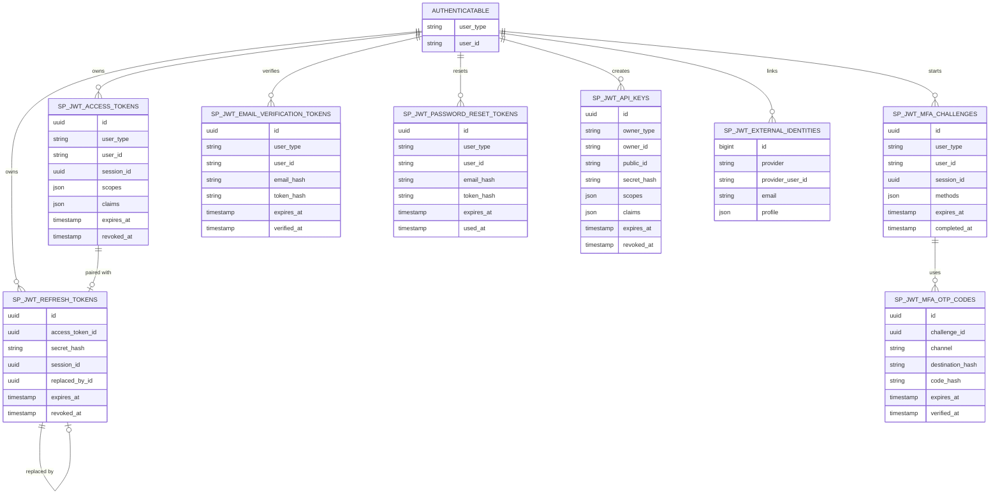

### OAuth2 Storage Relationship Diagram

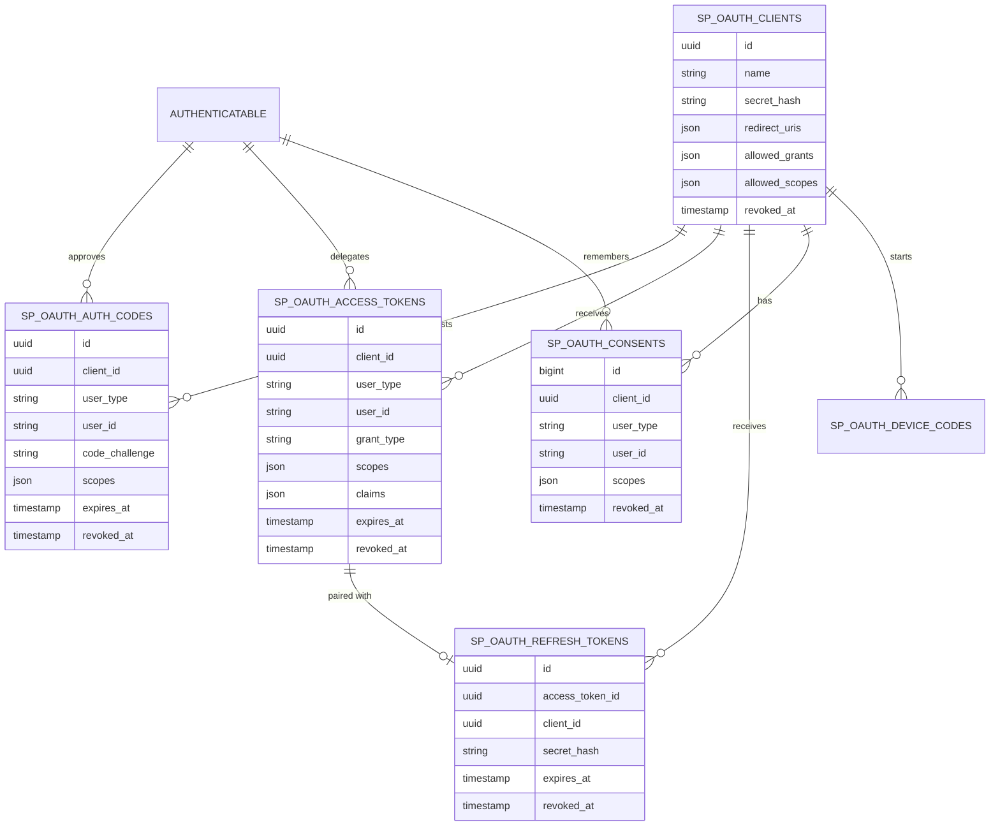

## Core Classes

### `JwtTokenService`

Responsibilities:

- Issue access/refresh token pairs.
- Validate access tokens.
- Rotate refresh tokens.
- Revoke tokens.
- Detect refresh token reuse.

Methods:

```php
issueTokenPair(Authenticatable $user, TokenContext $context): TokenPair;

validateAccessToken(string $jwt): JwtAccessToken;

rotateRefreshToken(string $refreshToken, ?TokenContext $override = null): TokenPair;

revokeAccessToken(string $jti): void;

revokeSession(string $sessionId): void;

revokeAllForUser(Authenticatable $user): void;
```

### `JwtGuard`

Laravel guard driver.

Responsibilities:

- Read bearer token.
- Validate JWT through `JwtTokenService`.
- Resolve user through Laravel user provider.
- Attach `JwtAccessToken` to the user model.
- Update `last_used_at`.

### `HasJwtTokens`

Trait for user models.

Methods:

```php
withAccessToken(JwtAccessToken $token): static;

token(): ?JwtAccessToken;

tokenCan(string $scope): bool;
```

## Laravel Web and API Compatibility

The package must work in normal Laravel applications, not only headless APIs. A consuming app may use Blade, Livewire, Inertia, controllers, route middleware, Laravel Notifications, Eloquent models, Gates, Policies, and API routes in the same codebase.

### Supported Laravel Capabilities

| Capability | Support Requirement |
| --- | --- |
| Eloquent user providers | Resolve users through Laravel's configured auth provider. Do not assume `App\Models\User` or integer ids. |
| Eloquent token models | Package token tables may expose Eloquent models while service internals can still use query builder for performance-critical paths. |
| Controllers | All brokers/services can be called from normal Laravel controllers. |
| Blade views | Apps can build login, email verification, password reset, MFA, OAuth consent, and API key screens in Blade. |
| Livewire | Brokers return DTOs that Livewire components can use without depending on JSON response helpers. |
| Inertia | Brokers return DTOs that controllers can pass to Inertia pages. |
| Laravel Notifications | Email verification, password reset, and OTP senders can be implemented as Notification classes. |
| Mailables/views | Apps can publish or bind custom Blade mail templates. |
| Gates and Policies | Apps can authorize API key creation, OAuth client management, tenant switching, and MFA changes with standard Laravel authorization. |
| Route middleware | Package middleware works alongside `web`, `api`, `auth`, `can`, `verified`, throttling, and tenant middleware. |
| Events/listeners | Package lifecycle events use Laravel's event dispatcher. |
| Queues | Notification senders can queue mail/SMS jobs through Laravel queues. |

### Guard Strategy

Recommended guard usage:

| Surface | Guard | Purpose |
| --- | --- | --- |
| Blade/Livewire/Inertia web pages | `web` | Browser session authentication. |
| First-party SPA/mobile API | `api` using `sp-jwt` | JWT access and refresh token authentication. |
| Integration API keys | `sp-api-key` or middleware `sp.api_key` | Tenant/company-owned opaque API key authentication. |
| OAuth2 resource APIs | `sp-oauth` | Third-party OAuth client access. |

Rules:

- The package must not replace Laravel's `web` session guard.
- Web apps can use package brokers from controllers or Livewire actions.
- API routes can use DTO helpers for JSON responses.
- Web routes can redirect, flash messages, or render views after broker calls.
- `auth:api` remains the default first-party API integration path.

### Web UI and Notification Template Ownership

The package must ship default notification templates so an app can use OTP, email verification, and password reset immediately after install. The app still owns final branding and can publish or override all templates.

Required default templates:

- `sp-jwt-auth::mail.otp-code`
- `sp-jwt-auth::mail.email-verification`
- `sp-jwt-auth::mail.password-reset`

Recommended publishable stubs:

- OTP mail view
- email verification mail view
- password reset mail view
- OAuth consent Blade view
- API key management Blade/Livewire example

Apps can replace all templates through config, Laravel view publishing, or container bindings. Default templates must be plain, brand-neutral, accessible, and safe for immediate production use.

### Laravel Notification Integration

Notification sender contracts can be implemented with Laravel Notifications:

```php
final class PasswordResetNotificationSender implements PasswordResetSender
{
    public function send(PasswordResetDispatch $dispatch): void
    {
        $dispatch->user->notify(new ResetPasswordNotification(
            token: $dispatch->plaintextToken,
            url: $dispatch->resetUrl,
            template: $dispatch->template,
        ));
    }
}
```

### Mixed Web/API Flow Example

```text
Blade or Livewire login page
    -> app validates credentials with Laravel auth services
    -> package creates MFA/OTP challenge if needed
    -> web UI renders OTP form
    -> after OTP, app can either:
        -> log user into web guard for browser session
        -> issue JWT token pair for SPA/mobile client
        -> issue both when app explicitly needs both
```

### `JwtAccessToken`

Value object attached to authenticated user.

Properties:

- `id`
- `user_type`
- `user_id`
- `session_id`
- `subject_type`
- `subject_id`
- `scopes`
- `claims`
- `expires_at`
- `revoked`
- `last_used_at`

Methods:

```php
can(string $scope): bool;

claim(string $key, mixed $default = null): mixed;

subject(): ?TokenSubject;
```

### `TokenContext`

Input DTO for issuing tokens. This is the main extension point for application-specific token data.

Fields:

- `scopes`
- `claims`
- `subjectType`
- `subjectId`
- `audience`
- `deviceId`
- `sessionId`
- `metadata`

Example for a SaaS app that wants to place active tenant identity in the token:

```php
$context = TokenContext::make()
    ->scopes(['client', 'tenant:42'])
    ->subject(type: 'tenant', id: '42')
    ->claims([
        'tenant_id' => 42,
        'tenant_code' => 'ACME',
        'tenant_role' => 'owner',
    ]);
```

The package persists this context into token tables and signs the selected safe values into the JWT payload. On API requests, the guard exposes the validated context through `$request->user()->token()`.

### `TokenSubject`

Structured active subject value for tenant/company/workspace context.

Fields:

- `type`: app-defined string such as `tenant`, `company`, `workspace`, or `organization`
- `id`: app-defined identifier as string

Rules:

- `subjectType` and `subjectId` are first-class fields for common active tenant context.
- App-specific values beyond the active subject belong in `claims`.
- Subject values must be persisted in the DB token row and verified by `jti` lookup, not trusted from JWT payload alone.
- Consuming apps decide whether the subject maps to a real tenant/company and whether the authenticated user still has access.

### `LoginIdentifierResolver`

Optional helper contract for apps that want package-assisted username/email login resolution. The package still must not own password policy or user persistence.

Methods:

```php
resolveByIdentifier(string $identifier, array $allowedIdentifiers = ['email', 'username']): ?Authenticatable;

validatePassword(Authenticatable $user, string $password): bool;
```

Default behavior:

- `identifier_mode=email_or_username`
- first normalize the submitted identifier
- if it contains `@`, try email first
- otherwise try username first
- if not found, try the other configured identifier
- password verification uses Laravel's configured hasher
- failed login response should not reveal whether email/username exists

Apps can replace this resolver when they need phone login, employee id login, LDAP lookup, external identity lookup, or custom user tables.

### `EmailVerificationBroker`

Creates and verifies account email verification tokens.

Methods:

```php
createVerificationToken(
    Authenticatable $user,
    string $email,
    array $metadata = []
): EmailVerificationDispatch;

resendVerificationToken(string $tokenId): EmailVerificationDispatch;

verifyEmailToken(string $token): EmailVerificationResult;

revokeVerificationTokens(Authenticatable $user, ?string $email = null): void;
```

Rules:

- The package returns a dispatch DTO and calls an app-bound sender/notification contract.
- The package provides a default email verification template.
- The app can customize the email template, subject, sender, locale, and branding.
- The app owns the final user update such as setting `email_verified_at`.
- Plaintext verification token is only available during dispatch and must never be logged.

### `PasswordResetBroker`

Creates and verifies forgot-password reset tokens.

Methods:

```php
createResetToken(
    Authenticatable $user,
    string $email,
    array $metadata = []
): PasswordResetDispatch;

verifyResetToken(string $token): PasswordResetResult;

consumeResetToken(string $token): PasswordResetResult;

revokeResetTokens(Authenticatable $user): void;
```

Rules:

- The package validates token integrity, expiry, reuse, and attempts.
- The app owns password hashing, password history rules, validation, and persistence.
- The package provides a default password reset template.
- The app can customize the email template and reset URL.
- Consuming a reset token should revoke existing access/refresh tokens for that user when the app requests it.

### `ApiKeyService`

Creates and validates opaque API keys for direct third-party integrations.

Methods:

```php
createApiKey(ApiKeyContext $context): ApiKeyPlaintextResult;

validateApiKey(string $plaintextKey): ApiKeyPrincipal;

revokeApiKey(string $apiKeyId): void;

revokeApiKeysForOwner(string $ownerType, string $ownerId): void;

rotateApiKey(string $apiKeyId): ApiKeyPlaintextResult;
```

Rules:

- API keys are opaque strings returned only once.
- Only `public_id`, `secret_hash`, `hash_key_id`, and safe `key_preview` are stored.
- API keys can have scopes, claims, allowed IPs, and expiry date.
- API key principals are not normal logged-in users unless the app explicitly maps them.
- API keys are for simple server-to-server integration. Use optional OAuth2 server mode when third-party apps need user consent, redirect flows, and client registration.

## Token Claims

JWT payload must include:

- `iss`
- `sub`
- `jti`
- `iat`
- `nbf`
- `exp`
- `scopes`
- `sid`
- optional `aud`
- optional `subject`
- app-defined custom claims

Custom claims are allowed, but reserved registered JWT claim names cannot be overridden by application code:

- `iss`
- `sub`
- `aud`
- `exp`
- `nbf`
- `iat`
- `jti`
- `sid`
- `scopes`
- `subject`

Validation must check:

- allowed algorithm
- signature
- `iss`
- `aud` when configured
- `exp`
- `nbf`
- persisted `jti`
- not revoked
- token row expiry

## Signing Key Rotation

JWT signing keys must support safe rotation without invalidating all active users unless the app intentionally performs an emergency cutover.

Rules:

- Every signed JWT must include a `kid` header.
- `keys.active_kid` signs new tokens.
- `keys.previous_kids` validates tokens issued before rotation until the grace window ends.
- Public keys can be exposed through the package JWKS endpoint when `jwks_enabled` is true.
- Private keys must never be exposed through config cache dumps, logs, events, or JWKS.
- The package must support emergency revocation of a compromised `kid`.
- Rotation must not use `APP_KEY`.

### Key Lifecycle

| State | Meaning | Behavior |
| --- | --- | --- |
| `active` | Current signing key. | Signs and validates tokens. |
| `previous` | Old key inside grace window. | Validates existing tokens only. |
| `retired` | Old key after grace window. | No longer validates tokens. |
| `compromised` | Emergency revoked key. | Rejects all tokens immediately and triggers audit event. |

### Key Rotation Flow

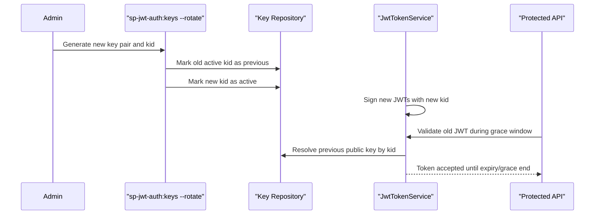

### Key Commands

Add command support:

```bash
php artisan sp-jwt-auth:keys --generate --kid=2026-06-primary
php artisan sp-jwt-auth:keys --rotate --kid=2026-07-primary
php artisan sp-jwt-auth:keys --retire --kid=2026-06-primary
php artisan sp-jwt-auth:keys --revoke --kid=2026-06-primary --compromised
php artisan sp-jwt-auth:jwks
```

### Hash-Key Rotation

Refresh tokens, OTP codes, email verification tokens, password reset tokens, and API keys use HMAC hash keys. These keys also need rotation support.

Rules:

- Store `hash_key_id` on rows that use HMAC hashing.
- New secrets use the active hash key.
- Validation tries the row's `hash_key_id`, not every key.
- Old hash keys can be retired after all rows that used them expire or are pruned.

## Custom Token Context

The package must support app-provided custom data during token issue and refresh. This is required for SaaS apps where login, refresh, or impersonation needs to embed active tenant/company/workspace identity into the token and later extract it during API requests.

### Supported Custom Data

Use structured fields for common context:

- `subjectType`: active context type, e.g. `tenant`, `company`, `workspace`
- `subjectId`: active context id, stored as string
- `scopes`: ability strings, e.g. `tenant:42`, `tenant_role:owner`
- `claims`: JSON-safe custom data, e.g. `tenant_id`, `tenant_code`, `tenant_role`

Do not use custom claims for secrets, passwords, OTPs, refresh tokens, provider tokens, billing secrets, or private credentials.

### Login Token Issue Example

The consuming application validates the user and tenant access, then passes tenant context to the package:

```php
$tenantId = 42;

$context = TokenContext::make()
    ->sessionId(Str::uuid()->toString())
    ->subject(type: 'tenant', id: (string) $tenantId)
    ->scopes([
        'client',
        'tenant:' . $tenantId,
        'tenant_role:owner',
    ])
    ->claims([
        'tenant_id' => $tenantId,
        'tenant_code' => 'ACME',
        'tenant_role' => 'owner',
    ]);

$pair = app(JwtTokenService::class)->issueTokenPair($user, $context);
```

### Refresh Token Context Preservation

On refresh, the package must preserve the prior token context by default:

- same `subjectType`
- same `subjectId`
- same `scopes`
- same app-defined `claims`
- same `sessionId`

The app may pass a `TokenContext` override only after it revalidates the requested context change. This is how tenant switching or company impersonation should work.

```php
$newContext = $oldContext
    ->subject(type: 'tenant', id: '84')
    ->replaceClaim('tenant_id', 84)
    ->replaceClaim('tenant_code', 'BETA')
    ->replaceScopes(['client', 'tenant:84', 'tenant_role:admin']);

$pair = app(JwtTokenService::class)->rotateRefreshToken(
    refreshToken: $request->input('refresh_token'),
    override: $newContext,
);
```

### API Request Extraction

After `auth:api` validates the bearer token, apps can extract the active context from the validated token object:

```php
$token = $request->user()->token();

$tenantId = $token?->subject_type === 'tenant'
    ? (int) $token->subject_id
    : null;

$tenantCode = $token?->claim('tenant_code');
```

The application must still validate that the tenant exists, is active, and the user has access. The package validates token integrity; the app validates business authorization.

### Tenant Validation Middleware Example

```php
public function handle(Request $request, Closure $next): Response
{
    $user = $request->user();
    $token = $user?->token();

    if (! $token || $token->subject_type !== 'tenant') {
        return response()->json(['message' => 'Tenant context is required.'], 403);
    }

    $tenantId = (int) $token->subject_id;

    $hasAccess = DB::table('tenant_users')
        ->where('tenant_id', $tenantId)
        ->where('user_id', $user->getAuthIdentifier())
        ->exists();

    if (! $hasAccess) {
        return response()->json(['message' => 'Invalid tenant or access denied.'], 403);
    }

    $request->attributes->set('resolved_tenant_id', $tenantId);

    return $next($request);
}
```

### Custom Claim Validation Rules

- Claims must be JSON-serializable scalar/array values.
- Claim keys must be strings and must not collide with reserved JWT claim names.
- Claim payload should remain small; large app state belongs in the database.
- Claim values are signed but visible to clients; do not store confidential values.
- Claims must be persisted in the token row and compared with validated `jti` row data.
- Apps can register an optional `TokenContextValidator` callback to reject unsafe or invalid custom context before issuing tokens.

### `TokenContextValidator`

Optional app callback invoked before issue or context override on refresh:

```php
interface TokenContextValidator
{
    public function validate(Authenticatable $user, TokenContext $context): void;
}
```

Example responsibilities:

- reject tenant id the user cannot access
- reject inactive tenant/company
- normalize subject ids to string
- strip unsafe claim keys
- enforce allowed scope prefixes

### Custom Tenant Context Flow Diagram

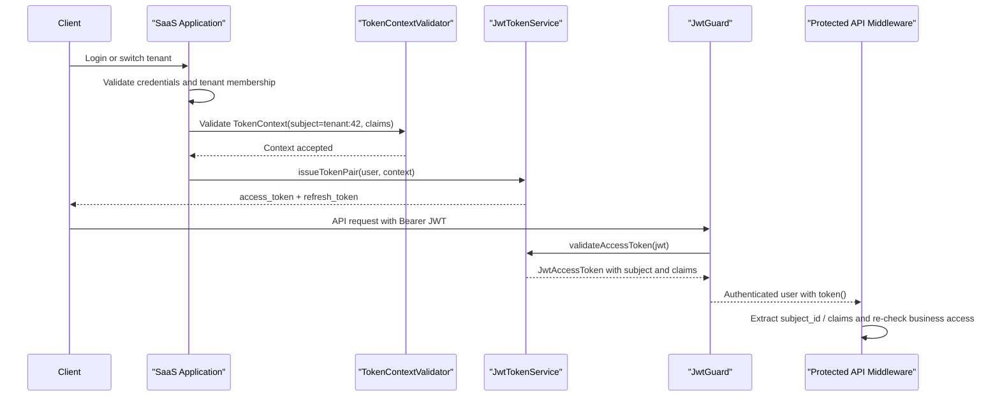

## Developer Extension Hooks

The package must expose hooks so consuming apps can customize behavior without changing package internals. Hooks should be normal Laravel container bindings, events, or pipeline callbacks.

Design goals:

- keep default behavior usable with no hooks registered
- allow apps to add tenant/company logic, audit logs, custom scopes, and notification behavior
- make hooks testable through contracts
- fail closed for security decisions
- keep hook execution order deterministic

### Hook Registration

Apps can register hooks in a service provider:

```php
public function boot(): void
{
    SpJwtAuth::hooks()
        ->beforeTokenIssue(App\Hooks\BuildTenantTokenContext::class)
        ->validateTokenContext(App\Hooks\ValidateTenantAccess::class)
        ->afterTokenIssue(App\Hooks\WriteAuthAuditLog::class)
        ->beforeApiKeyCreate(App\Hooks\ValidateApiKeyPolicy::class)
        ->resolveApiKeyPrincipal(App\Hooks\AttachTenantPrincipal::class);
}
```

### Hook Types

| Hook | Purpose | Failure Behavior |
| --- | --- | --- |
| `beforeTokenIssue` | Add/normalize scopes, claims, subject, device metadata. | Throwing exception blocks token issue. |
| `validateTokenContext` | Validate tenant/company/workspace access before token issue or refresh override. | Throwing exception blocks token issue. |
| `afterTokenIssue` | Audit token issue, update app session metadata, notify monitoring. | Failure is configurable; default logs and continues. |
| `beforeTokenRefresh` | Validate refresh context and optional context override. | Throwing exception blocks refresh. |
| `afterTokenRefresh` | Audit refresh rotation. | Failure is configurable; default logs and continues. |
| `beforeTokenRevoke` | Apply app policy before revocation. | Throwing exception blocks revocation only when configured. |
| `afterTokenRevoke` | Audit revocation. | Failure is configurable; default logs and continues. |
| `beforeMfaChallenge` | Decide allowed MFA methods for a user/session. | Throwing exception blocks challenge. |
| `afterMfaChallenge` | Audit challenge creation. | Failure is configurable; default logs and continues. |
| `beforeOtpSend` | Customize destination, locale, template metadata, rate-limit policy. | Throwing exception blocks send. |
| `afterOtpVerify` | Audit OTP verification or trigger step-up actions. | Failure is configurable; default logs and continues. |
| `beforeEmailVerificationSend` | Customize email verification URL/template metadata. | Throwing exception blocks send. |
| `afterEmailVerified` | Let app mark email verified or trigger audit/logging. | Failure is configurable; default logs and continues. |
| `beforePasswordResetSend` | Customize reset URL/template metadata. | Throwing exception blocks send. |
| `afterPasswordResetConsumed` | Let app revoke sessions or audit password reset. | Failure is configurable; default logs and continues. |
| `beforeApiKeyCreate` | Enforce owner policy, max TTL, allowed scopes, IP allowlist rules. | Throwing exception blocks key creation. |
| `resolveApiKeyPrincipal` | Add app context to API key principal after validation. | Throwing exception rejects API key request. |
| `afterApiKeyUsed` | Audit API key usage. | Failure is configurable; default logs and continues. |
| `beforeOAuthConsent` | Customize consent prompt, tenant context, approved scopes. | Throwing exception blocks authorization. |
| `afterOAuthTokenIssue` | Audit OAuth token issue. | Failure is configurable; default logs and continues. |

### Hook Contracts

Hooks receive immutable input DTOs and return either a modified DTO or `void`, depending on the hook.

```php
interface BeforeTokenIssueHook
{
    public function handle(TokenIssueContext $context): TokenIssueContext;
}

interface ValidateTokenContextHook
{
    public function validate(Authenticatable $user, TokenContext $context): void;
}

interface BeforeApiKeyCreateHook
{
    public function handle(ApiKeyContext $context): ApiKeyContext;
}

interface ResolveApiKeyPrincipalHook
{
    public function handle(ApiKeyPrincipal $principal): ApiKeyPrincipal;
}
```

### Hook Execution Rules

- Hooks run in registration order.
- Security hooks fail closed.
- Audit hooks fail open by default and emit an error log/event.
- Apps can configure selected audit hooks to fail closed.
- Hooks must not receive plaintext refresh token secrets after hashing.
- Hooks that receive plaintext OTP, email verification, password reset, or API key secrets must receive them only during dispatch/create flows and must not log them.
- Package events are still emitted even when no hooks are registered.

## Refresh Token Rotation

Refresh flow:

1. Parse `id.secret`.
2. Lock refresh token row.
3. Reject missing token.
4. Reject expired token.
5. Reject revoked token.
6. Hash submitted secret and compare with `secret_hash`.
7. Revoke current refresh token.
8. Revoke linked access token.
9. Issue new access/refresh pair.
10. Store `replaced_by_id`.
11. Preserve existing token context unless an app-approved override is supplied.

Reuse detection:

- If a revoked refresh token is submitted, treat it as reuse.
- Default action: revoke the full session.
- Configurable action: `reject_only`, `revoke_session`, `revoke_user`.

### Refresh Rotation Sequence Diagram

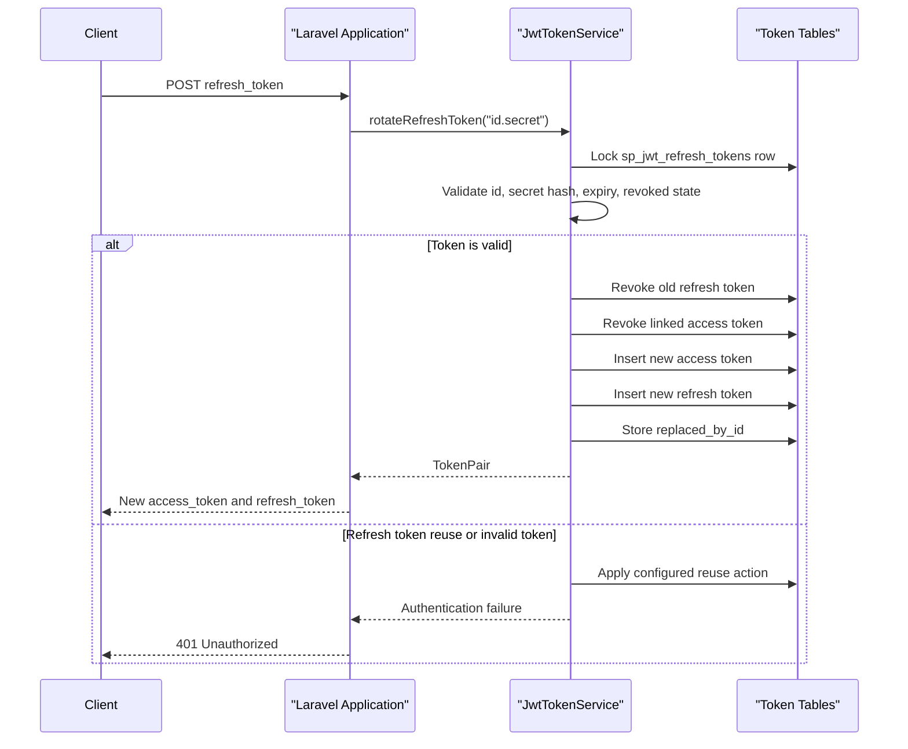

## External Identity Integration

The package provides generic provider identity handling. It does not decide whether a local user should be created or linked.

### `ExternalIdentityProvider`

```php
redirect(string $provider, array $options = []): RedirectResponse;

callback(string $provider, Request $request): ExternalIdentity;
```

### `ExternalIdentity`

Fields:

- `provider`
- `providerUserId`
- `email`
- `emailVerified`
- `name`
- `avatar`
- `rawProfile`
- `providerTokens`

## Socialite Support

When `laravel/socialite` is installed:

- Support configured Socialite providers.
- Support `stateless` mode for APIs.
- Normalize Socialite user data to `ExternalIdentity`.
- Do not store provider tokens unless configured.

Typical app flow:

1. App redirects user to provider.
2. Package resolves provider callback into `ExternalIdentity`.
3. App links or creates local user.
4. App applies MFA/business rules.
5. App calls `JwtTokenService::issueTokenPair()`.

### Social Login Sequence Diagram

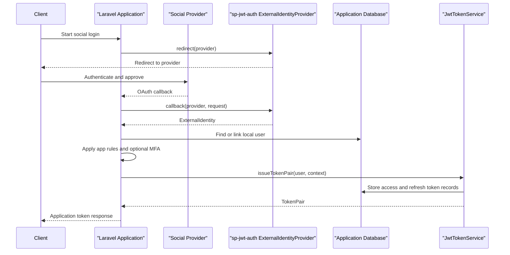

## OIDC Support

Generic OIDC adapter should support:

- Authorization Code + PKCE
- state validation
- nonce validation
- issuer validation
- audience validation
- JWKS signature validation
- ID token expiry validation
- userinfo fetch when configured

Supported providers by configuration:

- Google
- Apple
- Microsoft Entra ID
- Auth0
- Keycloak
- Any standards-compliant OIDC provider

### OIDC Authorization Code Flow Diagram

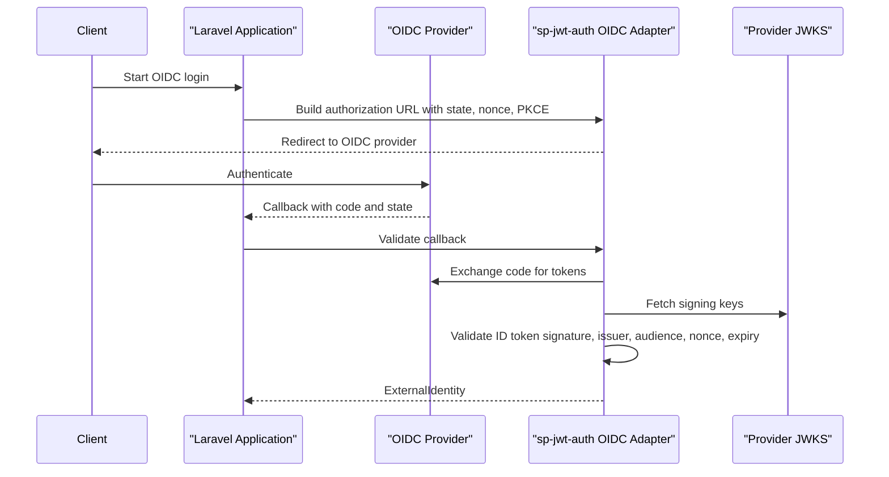

## Optional OAuth2 Authorization Server

The package can provide a full OAuth2 authorization server for applications that need third-party API clients. This is not required for first-party SaaS login and must remain disabled by default.

Use this module when the consuming app wants external systems to connect to its API through OAuth client registration, user consent, scopes, and standards-compatible token endpoints.

Implementation rule: use `league/oauth2-server` behind package interfaces for protocol-level OAuth2 behavior when this module is enabled. Do not couple the first-party JWT guard to the OAuth2 server dependency.

Boundary rule: OAuth2 server tokens are separate from first-party `sp_jwt_access_tokens`. OAuth2 tokens must use `sp_oauth_*` storage, `sp-oauth` guard/middleware, and OAuth-specific principals.

### Supported Grants

Default supported grants:

- Authorization Code with PKCE
- Refresh Token
- Client Credentials

Optional grants:

- Device Authorization Grant, disabled by default

Unsupported or discouraged grants:

- Implicit Grant must not be enabled for new apps.
- Resource Owner Password Credentials Grant must not be enabled by default. If ever added for legacy migration, it must require explicit config and deprecation warnings.

### OAuth2 Routes

Routes are registered only when `oauth_server.enabled` is true.

| Method | Path | Purpose |
| --- | --- | --- |
| `GET` | `/oauth/authorize` | Validate authorization request and return app-owned consent view/redirect decision. |
| `POST` | `/oauth/authorize/approve` | Approve requested scopes and issue authorization code. |
| `POST` | `/oauth/authorize/deny` | Deny authorization request. |
| `POST` | `/oauth/token` | Exchange authorization code, refresh token, or client credentials for OAuth tokens. |
| `POST` | `/oauth/revoke` | Revoke OAuth access or refresh token. |
| `POST` | `/oauth/introspect` | Optional token introspection endpoint for trusted resource servers. |
| `GET` | `/oauth/jwks` | Optional public key endpoint when OAuth access tokens are JWTs. |

The package validates protocol details. The application decides UI, branding, tenant selection, and whether the current user may approve the requested client and scopes.

### Core OAuth2 Classes

#### `OAuthServerService`

Responsibilities:

- Validate authorization requests.
- Issue authorization codes.
- Exchange authorization codes with PKCE verification.
- Issue client-credentials tokens.
- Rotate OAuth refresh tokens.
- Revoke OAuth tokens.
- Expose introspection payloads when enabled.

Methods:

```php
validateAuthorizationRequest(Request $request): OAuthAuthorizationRequest;

approveAuthorizationRequest(
    OAuthAuthorizationRequest $request,
    Authenticatable $user,
    OAuthConsentContext $context
): OAuthAuthorizationCode;

denyAuthorizationRequest(OAuthAuthorizationRequest $request): RedirectResponse;

issueTokenFromRequest(Request $request): OAuthTokenResponse;

revokeToken(string $token, ?string $hint = null): void;

introspect(string $token): OAuthIntrospectionPayload;
```

#### `OAuthClientRepository`

Responsibilities:

- Create, update, revoke, and rotate OAuth clients.
- Hash confidential client secrets.
- Validate redirect URIs by exact match.
- Validate allowed grants and scopes.

Methods:

```php
createClient(OAuthClientData $data): OAuthClient;

rotateSecret(string $clientId): OAuthClientSecret;

revokeClient(string $clientId): void;

findActiveClient(string $clientId): ?OAuthClient;
```

#### `OAuthConsentRepository`

Responsibilities:

- Persist approved user/client/scope combinations.
- Check remembered consent.
- Revoke consent.

Methods:

```php
hasConsent(Authenticatable $user, OAuthClient $client, array $scopes): bool;

rememberConsent(Authenticatable $user, OAuthClient $client, array $scopes): void;

revokeConsent(Authenticatable $user, OAuthClient $client): void;
```

#### `OAuthScopeRepository`

Responsibilities:

- Register available scopes.
- Validate requested scopes.
- Provide display labels/descriptions for consent UI.

#### `OAuthPrincipal`

Represents the authenticated OAuth resource-server principal.

Fields:

- `client_id`
- `user_type`
- `user_id`
- `grant_type`
- `scopes`
- `claims`
- `token_id`
- `expires_at`

Rules:

- Authorization-code tokens have both user and client context.
- Client-credentials tokens have client context and no user context.
- Middleware must not assume every OAuth token maps to a user.

### OAuth2 and First-Party JWT Coexistence

First-party app users and third-party OAuth clients serve different use cases and should have separate guard behavior:

| Use Case | Recommended Guard | Token Store | Principal |
| --- | --- | --- | --- |
| SPA/mobile first-party login | `auth:api` using `sp-jwt` | `sp_jwt_*` | Application user |
| Third-party API client acting for a user | `sp-oauth` | `sp_oauth_*` | User plus OAuth client |
| Machine-to-machine integration | `sp-oauth` | `sp_oauth_*` | OAuth client only |

Apps can protect routes with one or both guards depending on endpoint needs. For example, internal app endpoints can use `auth:api`, while public integration APIs can use `sp-oauth` and scope middleware.

### OAuth2 Token Format Boundary

The OAuth2 server module must explicitly choose one access-token format through config.

| Format | Config | Validation | Recommended Use |
| --- | --- | --- | --- |
| Opaque OAuth access token | `access_token_format=opaque` | Database lookup or introspection. | Default for simple Laravel resource servers. |
| JWT OAuth access token | `access_token_format=jwt` | Signature + `kid` + DB `jti`/revocation check. | Distributed resource servers that need local signature validation. |

Default: `opaque`.

Rules:

- First-party JWT tokens and OAuth2 access tokens must not share tables.
- OAuth2 JWT tokens must use OAuth-specific `aud`, `client_id`, `grant_type`, and scopes.
- OAuth2 JWT tokens must still check `sp_oauth_access_tokens` for revocation unless the app explicitly configures stateless validation.
- Opaque OAuth tokens must not be parsed as JWT.
- Resource APIs should use `sp-oauth` middleware for OAuth tokens, not `auth:api`.
- Client-credentials tokens must produce `OAuthPrincipal` with `client_id` and no user id.

### OAuth2 Repository Mapping

When `league/oauth2-server` is enabled, repository adapters must map protocol entities to package tables:

| League Repository | Package Table |
| --- | --- |
| Client repository | `sp_oauth_clients` |
| Scope repository | Config/app-bound `OAuthScopeRepository` |
| Auth code repository | `sp_oauth_auth_codes` |
| Access token repository | `sp_oauth_access_tokens` |
| Refresh token repository | `sp_oauth_refresh_tokens` |
| Device code repository | `sp_oauth_device_codes` when enabled |

Repository rules:

- Authorization codes are one-time use and revoked immediately after exchange.
- Refresh tokens rotate when the grant supports refresh.
- Revoked OAuth clients cannot authorize, refresh, introspect, or use client credentials.
- Consent state is package-owned in `sp_oauth_consents`, but UI and approval policy are app-owned.

### Authorization Code + PKCE Flow

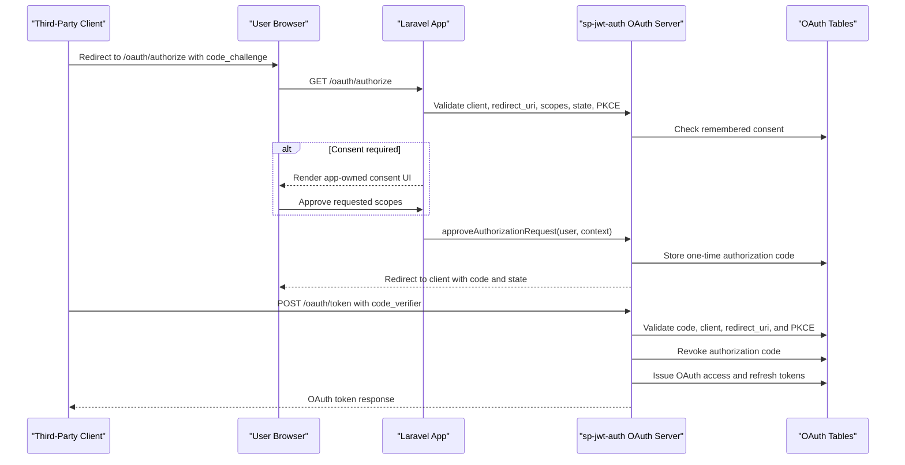

### Client Credentials Flow

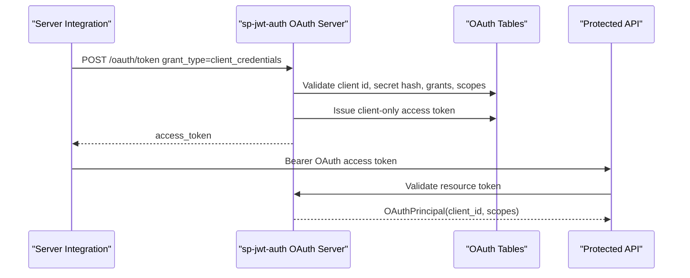

### OAuth2 Scope and Claim Rules

- OAuth scopes must be configured and documented by the consuming app.
- A client can only request scopes included in `allowed_scopes`.
- User consent can approve fewer scopes than requested.
- Client-credentials tokens must not receive user-only scopes unless the app explicitly maps them to service permissions.
- App-defined OAuth claims are allowed, but must follow the same safety rules as JWT custom claims.
- Tenant/company claims for OAuth tokens must be approved by the app and persisted in the OAuth token row.

### OAuth2 Security Requirements

- Public clients must use PKCE.
- Confidential client secrets must be hashed at rest.
- Redirect URIs must use exact matching.
- Authorization codes must be one-time use.
- Authorization codes must expire quickly, default 10 minutes.
- Token endpoint must rate-limit failed client authentication.
- Client credentials must not be accepted through query strings.
- Consent screens must clearly show client name and requested scopes.
- Revoked clients must fail all authorization and token requests.
- Device authorization user codes must be hashed if the optional device grant is enabled.

## MFA Support

Package provides MFA challenge infrastructure and optional email/phone OTP verification. It must not own product-specific MFA policy, user contact verification policy, or delivery provider credentials.

### `MfaChallengeBroker`

```php
create(Authenticatable $user, TokenContext $context): MfaChallenge;

resolve(string $challengeId): MfaChallenge;

complete(string $challengeId): TokenContext;

expire(string $challengeId): void;
```

Rules:

- MFA challenge stores auth intent only.
- Never store plaintext password.
- Never store TOTP secret, WebAuthn private material, or plaintext OTP code.
- App verifies Google2FA, WebAuthn, passkey proof, or delegates email/phone OTP verification to the optional OTP broker.
- After verification, app calls package to issue token pair.

### Email and Phone OTP

The package should support email and phone OTP as an optional MFA method for apps that need second-factor or passwordless verification.

Supported channels:

- `email`
- `sms`
- `voice`
- `whatsapp`
- app-defined channel names through configuration

Package responsibilities:

- generate random numeric or alphanumeric OTP codes
- hash OTP codes before storage
- hash normalized destinations for lookup/rate-limit
- store only masked destination values for display
- enforce OTP expiry
- enforce max attempts
- enforce resend cooldown
- verify code with timing-safe comparison
- mark OTP code and MFA challenge as consumed

Application responsibilities:

- verify that the user owns the email or phone destination
- normalize phone numbers to E.164 before passing them to the package
- choose delivery provider such as Laravel Mail, Twilio, Vonage, AWS SNS, WhatsApp Business, or a custom gateway
- render response shape and UI text
- decide whether OTP can be used for login, step-up MFA, tenant switching, or sensitive actions

### `OtpChallengeBroker`

```php
createOtp(
    MfaChallenge $challenge,
    OtpDestination $destination,
    array $options = []
): OtpDispatch;

resendOtp(string $otpId): OtpDispatch;

verifyOtp(string $challengeId, string $code): TokenContext;

revokeOtp(string $otpId): void;
```

### `OtpChannelSender`

The package calls this app-bound contract after creating an OTP code. The sender receives the plaintext OTP only once and must never log it.

```php
interface OtpChannelSender
{
    public function send(OtpDispatch $dispatch): void;
}
```

### `OtpDestination`

```php
OtpDestination::email('user@example.com');

OtpDestination::phone('+85512345678', channel: 'sms');
```

Fields:

- `channel`
- `normalized_destination`
- `masked_destination`
- `locale`
- `metadata`

### Email/Phone OTP Flow Diagram

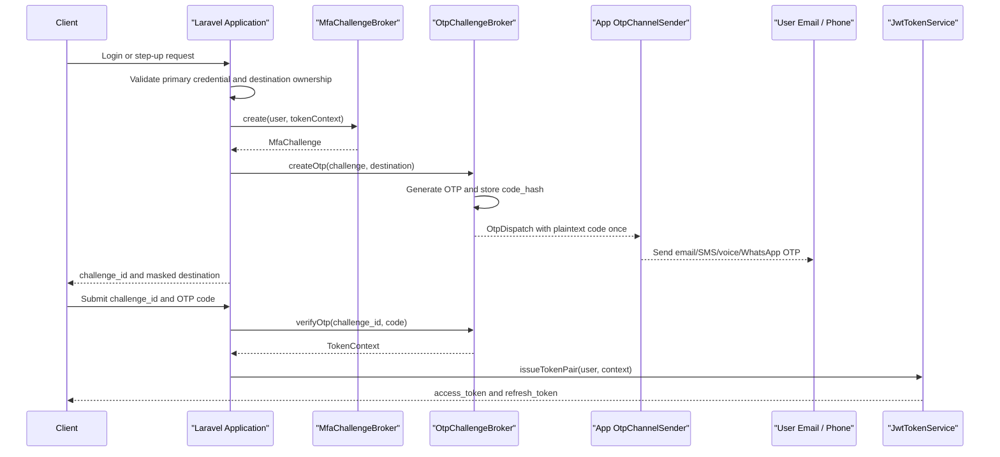

### MFA Challenge Flow Diagram

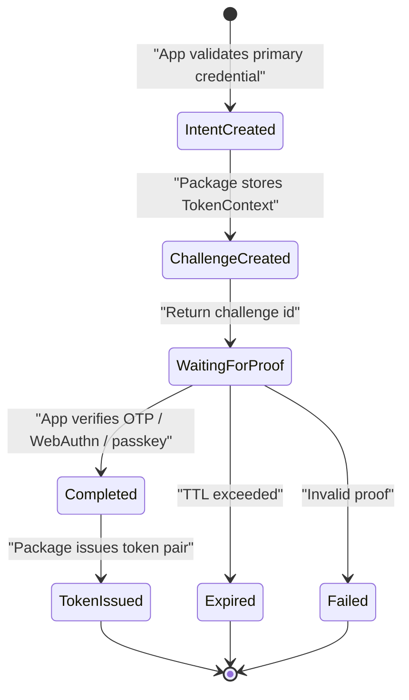

## Account Email Verification

Email verification is optional and disabled by default. It is useful when an app wants the package to create secure verification links while keeping user registration and profile updates in the application.

Package responsibilities:

- create one-time verification token
- hash token before storage
- hash normalized email for lookup/rate-limit
- store masked email for safe display
- enforce expiry and reuse prevention
- call app-bound notification sender with plaintext token once

Application responsibilities:

- decide when verification is required
- choose custom email template and subject
- build the frontend verification URL
- update user record after verification, e.g. `email_verified_at`
- decide whether to revoke sessions when an email changes

### `EmailVerificationSender`

```php
interface EmailVerificationSender
{
    public function send(EmailVerificationDispatch $dispatch): void;
}
```

### Email Verification Flow Diagram

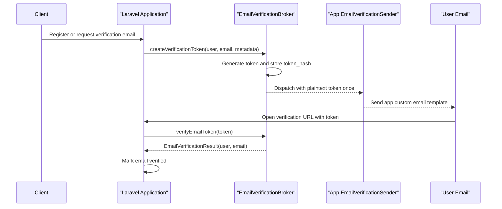

## Forgot Password

Forgot-password support is optional and disabled by default. The package owns reset token safety; the app owns password policy and the actual password update.

Package responsibilities:

- create one-time reset token
- hash token before storage
- hash normalized email for lookup/rate-limit
- enforce expiry, attempts, and reuse prevention
- call app-bound notification sender with plaintext token once
- optionally revoke active sessions after successful reset when requested

Application responsibilities:

- decide whether the submitted email maps to a resettable user
- avoid account enumeration in public responses
- choose custom email template and reset URL
- validate new password strength and confirmation
- hash and store the new password

### `PasswordResetSender`

```php
interface PasswordResetSender
{
    public function send(PasswordResetDispatch $dispatch): void;
}
```

### Forgot Password Flow Diagram

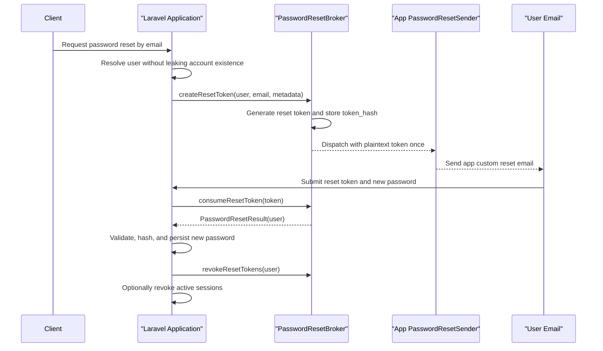

## API Keys

API keys are optional opaque tokens for direct integrations. They are useful when a tenant/company wants to create a scoped key for a trusted third-party system to call APIs without OAuth redirects.

Recommended use cases:

- tenant-owned integration scripts
- server-to-server webhook processors
- internal automation
- trusted partner integration where OAuth consent is unnecessary

Not recommended for:

- public browser apps
- untrusted third-party apps needing delegated user consent
- marketplace apps where OAuth2 client lifecycle is required

Package responsibilities:

- generate high-entropy opaque API key
- return plaintext key only once
- store public lookup id, HMAC secret hash, and safe preview
- validate public id, secret hash, expiry, revocation, scopes, and optional IP allowlist
- expose `ApiKeyPrincipal` to middleware
- update `last_used_at`

Application responsibilities:

- decide who may create API keys
- decide owner context such as tenant/company/workspace
- configure allowed scopes
- show key preview and last-used data
- audit key creation/revocation

### API Key Format

Recommended format:

```text
spak_live_<public_id>.<secret>
```

Rules:

- Prefix is configurable.
- Environment segment is configurable, e.g. `live`, `test`, or `sandbox`.
- `public_id` is safe to store and use for indexed lookup.
- Secret must be at least 256 bits of entropy.
- Only the secret part is HMAC-hashed in `secret_hash`.
- Validation must lookup by `public_id`, then timing-safe compare submitted secret with `secret_hash`.
- Plaintext full key is returned once and cannot be recovered.
- API keys must not use JWT format and must not contain signed claims; claims are loaded from the DB row.

### API Key Flow Diagram

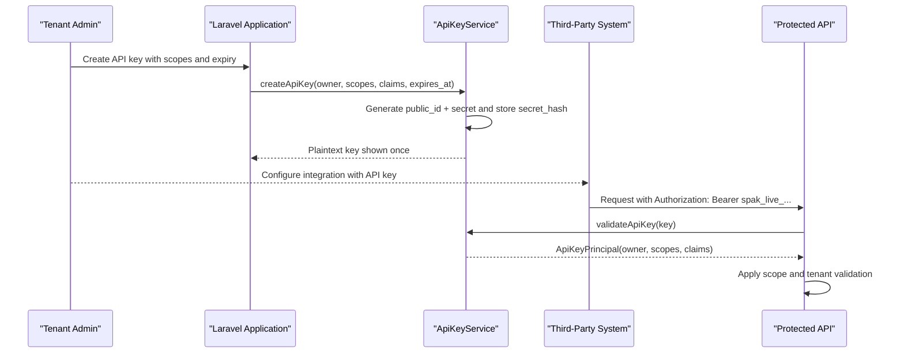

## Events

Emit events:

- `TokenIssued`
- `TokenRefreshed`
- `TokenRevoked`
- `SessionRevoked`
- `AllUserTokensRevoked`
- `RefreshTokenReuseDetected`
- `ExternalIdentityResolved`
- `MfaChallengeCreated`
- `MfaChallengeCompleted`
- `OtpCodeCreated`
- `OtpCodeSent`
- `OtpCodeResent`
- `OtpCodeVerified`
- `OtpCodeFailed`
- `OtpCodeLocked`
- `OtpCodeExpired`
- `EmailVerificationTokenCreated`
- `EmailVerificationSent`
- `EmailVerified`
- `PasswordResetTokenCreated`
- `PasswordResetSent`
- `PasswordResetTokenConsumed`
- `ApiKeyCreated`
- `ApiKeyUsed`
- `ApiKeyRevoked`
- `ApiKeyRotated`
- `OAuthClientCreated`
- `OAuthClientSecretRotated`
- `OAuthClientRevoked`
- `OAuthAuthorizationApproved`
- `OAuthAuthorizationDenied`
- `OAuthTokenIssued`
- `OAuthTokenRevoked`
- `OAuthConsentRevoked`

Apps can listen for audit logging.

## Middleware

Provide middleware:

- `sp.jwt`
- `sp.jwt.scope:<scope>`
- `sp.jwt.any_scope:<scope1>,<scope2>`
- `sp.jwt.session_active`
- `sp.oauth`
- `sp.oauth.scope:<scope>`
- `sp.oauth.any_scope:<scope1>,<scope2>`
- `sp.oauth.client:<client_id>`
- `sp.api_key`
- `sp.api_key.scope:<scope>`
- `sp.api_key.any_scope:<scope1>,<scope2>`

Example:

```php
Route::middleware(['auth:api', 'sp.jwt.scope:super-admin'])->group(function () {
    // protected routes
});

Route::middleware(['sp.oauth', 'sp.oauth.scope:invoices.read'])->group(function () {
    // third-party integration routes
});

Route::middleware(['sp.api_key', 'sp.api_key.scope:invoices.write'])->group(function () {
    // API key integration routes
});
```

## Artisan Commands

### `sp-jwt-auth:install`

Publishes:

- config
- migrations
- optional key files

### `sp-jwt-auth:keys`

Generates, rotates, retires, or revokes signing key pairs.

Options:

- `--generate`
- `--rotate`
- `--retire`
- `--revoke`
- `--force`
- `--kid=`
- `--compromised`
- `--algorithm=RS256`
- `--path=storage`

### `sp-jwt-auth:jwks`

Prints or writes the public JWKS payload for active and previous public keys.

Options:

- `--output=`
- `--pretty`
- `--active-only`

### `sp-jwt-auth:prune`

Deletes expired/revoked tokens.

Options:

- `--expired-days=30`
- `--revoked-days=30`
- `--dry-run`

### `sp-jwt-auth:email-verification-prune`

Deletes expired/used email verification tokens.

Options:

- `--expired-days=7`
- `--verified-days=7`
- `--dry-run`

### `sp-jwt-auth:password-reset-prune`

Deletes expired/used password reset tokens.

Options:

- `--expired-days=1`
- `--used-days=7`
- `--dry-run`

### `sp-jwt-auth:api-key`

Creates an API key for an owner from CLI when enabled.

Options:

- `--owner-type=`
- `--owner-id=`
- `--name=`
- `--scope=`
- `--expires-at=`
- `--allowed-ip=`

### `sp-jwt-auth:api-key-prune`

Deletes expired/revoked API keys after retention window.

Options:

- `--expired-days=30`
- `--revoked-days=90`
- `--dry-run`

### `sp-jwt-auth:oauth-client`

Creates or updates an OAuth2 client when OAuth server mode is enabled.

Options:

- `--name=`
- `--redirect-uri=`
- `--grant=authorization_code`
- `--scope=`
- `--public`
- `--confidential`
- `--owner-type=`
- `--owner-id=`

### `sp-jwt-auth:oauth-secret`

Rotates a confidential OAuth client secret.

Options:

- `--client-id=`
- `--show-once`

### `sp-jwt-auth:oauth-prune`

Deletes expired OAuth authorization codes and expired/revoked OAuth tokens.

Options:

- `--expired-days=30`
- `--revoked-days=60`
- `--dry-run`

## HTTP Response Helper

The package should return DTOs, not force HTTP response shape.

Provide optional helper:

```php
TokenResponse::passportCompatible(TokenPair $pair, array $extra = []): array;
```

Output:

```json
{
  "token_type": "Bearer",
  "expires_in": 900,
  "access_token": "...",
  "refresh_token": "uuid.secret"
}
```

Apps may merge extra fields:

```json
{
  "company_id": 1,
  "impersonated": true
}
```

## Security Requirements

- Never use `APP_KEY` as JWT signing key.
- Never trust JWT `alg` from token header dynamically.
- Never log access tokens.
- Never log refresh tokens.
- Never log provider tokens.
- Never log MFA proof values.
- Never log plaintext OTP codes.
- Refresh token secrets must be hashed.
- JWTs must include `kid` and validate only configured active/previous keys.
- Compromised signing keys must be immediately rejectable by `kid`.
- JWKS must expose public keys only.
- HMAC hash keys must support key ids before long-lived token families are enabled.
- OTP codes must be hashed.
- OTP destinations must be hashed for lookup and masked for display.
- OTP verification must use timing-safe comparison.
- OTP challenges must enforce expiry, max attempts, and resend cooldown.
- Email verification tokens must be hashed and single-use.
- Password reset tokens must be hashed, single-use, attempt-limited, and short-lived.
- Public forgot-password responses must avoid account enumeration.
- API keys must be opaque, high-entropy, hashed at rest, and returned only once.
- API key validation must lookup by public id, then check secret hash, expiry, revocation, scopes, owner context, and optional IP allowlist.
- API keys must not be accepted in query strings.
- Provider tokens must be encrypted when stored.
- Token rotation must run inside DB transaction.
- Refresh-token reuse must be detectable.
- Access token validation must check DB `jti`.
- Package must work with multiple active sessions per user.
- OAuth server mode must be disabled by default.
- OAuth authorization-code clients must use PKCE when public.
- OAuth redirect URI validation must use exact matching.
- OAuth confidential client secrets must be hashed.
- OAuth client-credentials tokens must not be treated as user-authenticated requests.

## App Integration Example

Credential lookup rule:

```text
App login endpoint
    -> accept login identifier such as email or username
    -> app resolves and validates Authenticatable user
    -> app validates password or primary credential
    -> package receives resolved user and TokenContext
    -> package issues token pair
```

Email-or-username password login:

```text
AuthFunctions::login
    -> accept { login, password }
    -> LoginIdentifierResolver checks email and username according to config
    -> resolver validates password with Laravel hasher
    -> app applies tenant/company/MFA rules
    -> package issues token pair after successful password validation
```

SpeedX app login flow:

```text
AuthFunctions::login
    -> validate email/password
    -> if 2FA enabled, create MFA challenge
    -> build app scopes: client, super-admin, company:{id}, company_id:{id}
    -> call JwtTokenService::issueTokenPair()
    -> return existing client response shape
```

Social login flow:

```text
AuthFunctions::socialCallback
    -> package resolves ExternalIdentity
    -> app finds or creates user
    -> app links external identity
    -> app applies company/role rules
    -> app applies MFA if needed
    -> package issues token pair
```

Email/phone OTP flow:

```text
AuthFunctions::login
    -> validate email/password or passwordless login intent
    -> verify selected email/phone belongs to the user
    -> create MFA challenge with TokenContext
    -> create email/SMS/voice/WhatsApp OTP through OtpChallengeBroker
    -> app-bound OtpChannelSender sends OTP
    -> client submits challenge_id + OTP code
    -> OtpChallengeBroker verifies code and returns TokenContext
    -> package issues token pair
```

Email verification flow:

```text
AuthFunctions::register
    -> app creates user
    -> if email verification enabled, package creates verification token
    -> app-bound EmailVerificationSender sends custom template
    -> user opens verification URL
    -> package verifies token
    -> app marks user email_verified_at
```

Forgot-password flow:

```text
AuthFunctions::forgotPassword
    -> app accepts email and returns generic response
    -> if user exists, package creates reset token
    -> app-bound PasswordResetSender sends custom template
    -> user submits token and new password
    -> package consumes token
    -> app validates and hashes new password
    -> app optionally revokes active sessions
```

API key integration flow:

```text
IntegrationFunctions::createApiKey
    -> app authorizes tenant admin
    -> app builds owner context, scopes, claims, expiry
    -> package creates opaque API key and stores public_id + secret_hash
    -> app shows plaintext key once
    -> third-party system calls API with bearer API key
    -> package validates key and exposes ApiKeyPrincipal
```

## Testing Requirements

Token service tests:

- issues valid JWT with expected claims
- signs JWT with configured active `kid`
- validates JWT signed by previous `kid` during grace window
- rejects JWT signed by retired or compromised `kid`
- JWKS exposes only public active/previous keys
- rejects expired token
- rejects malformed token
- rejects wrong signature
- rejects unknown `jti`
- rejects revoked token
- rotates refresh token
- rejects refresh token reuse
- never stores plaintext refresh secret
- revokes one session
- revokes all user sessions

Guard tests:

- `auth:api` authenticates valid bearer token
- no bearer token returns guest
- invalid token returns guest
- attached user exposes `token()`
- `tokenCan()` checks scopes

Login identifier tests:

- `email_or_username` mode authenticates with email and password
- `email_or_username` mode authenticates with username and password
- invalid password fails for both email and username
- failed login response does not reveal whether identifier exists
- app can replace `LoginIdentifierResolver`

Laravel integration tests:

- package works with configured Eloquent user provider
- package does not replace or break Laravel `web` guard
- brokers can be called from a controller and return DTOs
- brokers can be called from a Livewire component without JSON response coupling
- email verification sender can use Laravel Notification
- password reset sender can use Laravel Notification
- OAuth consent flow can render an app-owned Blade view
- API key management can be authorized through Laravel Gate/Policy
- package middleware composes with `auth`, `can`, throttle, and tenant middleware

External identity tests:

- Socialite user normalizes to `ExternalIdentity`
- OIDC callback validates state
- OIDC callback validates nonce
- OIDC callback validates issuer
- OIDC callback validates audience
- OIDC callback rejects invalid JWKS signature

MFA tests:

- challenge stores only intent
- expired challenge fails
- completed challenge returns token context
- challenge cannot be reused
- email OTP stores only code hash and masked destination
- phone OTP stores only code hash and masked destination
- OTP verification succeeds with valid code
- OTP verification rejects invalid code
- OTP verification locks after max attempts
- OTP verification rejects expired code
- OTP verification rejects reused code
- OTP resend enforces cooldown
- OTP sender receives plaintext code only during dispatch
- default OTP mail template renders with masked destination and expiry
- custom OTP template overrides default template

Email verification tests:

- email verification module is disabled by default
- verification token stores only token hash and masked email
- verification sender receives plaintext token only during dispatch
- valid token verifies email
- expired token fails
- reused token fails
- default email verification template renders verification URL and expiry
- custom template config is passed to sender

Password reset tests:

- password reset module is disabled by default
- reset token stores only token hash and masked email
- reset sender receives plaintext token only during dispatch
- public reset request can avoid account enumeration
- valid token can be consumed once
- expired token fails
- invalid token increments attempts
- token locks after max attempts
- app can revoke user sessions after password reset
- default password reset template renders reset URL and expiry
- custom password reset template overrides default template

API key tests:

- API key module is disabled by default
- API key plaintext is returned only once
- API key table stores public id, secret hash, and safe preview
- API key validation looks up by public id before comparing secret hash
- valid API key authenticates `ApiKeyPrincipal`
- expired API key fails
- revoked API key fails
- missing scope fails
- allowed IP mismatch fails
- `last_used_at` updates after successful validation
- API key claims expose owner/tenant context to middleware

Developer hook tests:

- hooks run in registration order
- `beforeTokenIssue` can add scopes and claims
- `validateTokenContext` can reject invalid tenant context
- `beforeTokenRefresh` can reject unsafe context override
- `beforeOtpSend` can customize template metadata
- `afterEmailVerified` hook is called after successful verification
- `afterPasswordResetConsumed` can trigger session revocation
- `beforeApiKeyCreate` can reject disallowed scope or expiry
- `resolveApiKeyPrincipal` can attach tenant context
- security hook exceptions fail closed
- audit hook exceptions log and continue by default

OAuth2 server tests:

- OAuth server routes are not registered when disabled
- OAuth server routes register when enabled
- opaque OAuth access token is the default format
- opaque OAuth token validates through OAuth token table
- OAuth JWT token validates signature, `kid`, and OAuth token row when JWT format is enabled
- first-party JWT guard rejects OAuth tokens
- `sp-oauth` guard rejects first-party JWT tokens
- authorization-code + PKCE flow succeeds
- invalid redirect URI fails
- invalid PKCE verifier fails
- authorization code cannot be reused
- remembered consent skips repeat consent when configured
- revoked consent requires approval again
- client-credentials flow succeeds for confidential client
- revoked client cannot authorize or receive tokens
- confidential client secret is never stored plaintext
- OAuth refresh token rotates and old token reuse fails
- `sp.oauth.scope` accepts granted scope
- `sp.oauth.scope` rejects missing scope
- client-credentials principal has client id and no user id

Migration tests:

- package migrations run on SQLite
- package migrations support PostgreSQL
- indexes exist for token lookup paths

## Documentation Requirements

Package docs must include:

- installation
- configuration
- key generation
- signing key rotation and JWKS
- hash-key rotation strategy
- guard setup
- Laravel web/API mixed app setup
- Blade, Livewire, and Inertia usage examples
- Laravel Notification sender examples
- default notification template publishing and override guide
- Gate and Policy integration examples
- issuing token pair
- refreshing token pair
- revoking tokens
- social login integration
- OIDC integration
- optional OAuth2 authorization server integration
- OAuth client management
- OAuth consent UI integration points
- OAuth scope design
- MFA challenge integration
- email and phone OTP integration
- OTP delivery provider examples
- email verification integration
- custom email verification templates
- forgot-password integration
- custom password reset templates
- API key integration
- API key scopes, expiry, revocation, and rotation
- developer hooks and lifecycle events
- hook failure behavior and security guidance
- SpeedX integration example
- migration from Passport
- security notes

## Acceptance Criteria

- A Laravel app can install the package and configure `auth.guards.api.driver = sp-jwt`.
- Core JWT can be installed without account, integration, external identity, or OAuth2 server modules.
- A Laravel app can keep using the normal `web` guard for Blade/Livewire/Inertia while using `sp-jwt` for APIs.
- Package brokers can be called from controllers, Livewire actions, queued jobs, or service classes.
- Apps can use Laravel Notifications and custom Blade mail templates for verification, reset, and OTP delivery.
- Package ships default OTP, email verification, and password reset notification templates.
- Apps can authorize package actions through Laravel Gates and Policies.
- App can issue token pair from any authenticated user model.
- API requests authenticate through bearer JWT.
- Refresh tokens rotate and old tokens cannot be reused.
- Apps can revoke current session and all user sessions.
- Apps can use Socialite/OIDC login and then issue local JWT tokens.
- Apps can create email/phone OTP challenges without storing plaintext OTP codes.
- Apps can bind their own OTP sender for email, SMS, voice, or WhatsApp delivery.
- Apps can enable email verification and send custom verification templates.
- Apps can enable forgot-password reset emails and keep password update logic app-owned.
- Apps can create expirable scoped API keys for third-party integrations.
- API keys use public id lookup, secret hash validation, and full plaintext keys are returned only once.
- Apps can register developer hooks for token context, MFA, email verification, password reset, API keys, OAuth consent, and audit logging.
- Apps can keep OAuth2 server mode disabled and use only first-party JWT auth.
- Apps can enable OAuth2 server mode, register a client, run authorization-code + PKCE, and validate OAuth resource tokens.
- OAuth2 tokens use separate storage and guards from first-party JWT tokens.
- OAuth client-credentials tokens authenticate as clients, not users.
- OAuth consent UI is app-owned while protocol validation is package-owned.
- Package has no dependency on SpeedX business tables.
- Package has no dependency on `sopheak/sp-laravel-api`.
- Test suite passes on Laravel 12 and Laravel 13.
